<!--
FORMAT NOTES FOR THE FINAL WORD/PDF VERSION: Times New Roman 12 pt, 1.5 line spacing, chapter starts on a new page.
Yellow highlights mark [INSERT: ...] items that only real field data can fill. No survey data, respondents or quotes have been invented.
Mermaid blocks render in GitHub, VS Code (Markdown Preview Mermaid Support), Obsidian and https://mermaid.live. Export them as images before pasting into Word.
-->

# CHAPTER 3: SYSTEM ANALYSIS AND DESIGN

## 3.1 Introduction

This chapter explains how DukaSmart was analysed and designed, and it describes the system exactly as the supplied source code builds it. The chapter follows the department's structure, moving from the development methodology and feasibility study to requirements elicitation, data analysis, specification, modelling, logical design and physical design. The earlier chapters stated the problem that a small shop owner must decide what to restock, in what quantity and in what order when money is limited. This chapter turns that problem into requirements and then into a design that can be inspected line by line against the code. Where the project documents and the code disagree, the code is treated as the source of truth, and each such difference is recorded in Appendix C.

The design evidence for this chapter comes from the backend files models.py, security.py, config.py, services/forecasting.py, services/recommendation.py and services/inventory.py, together with requirements.txt and the frontend package.json. These files define the database entities, the sign-in security, every tunable setting, the forecasting engine, the replenishment and priority logic, and the stock-changing operations. The files that wire these pieces to HTTP, namely the routers, the request and response schemas, database.py and main.py, were not part of the supplied code. For that reason the chapter describes the web layer only at the level that the supplied code proves, for example that a router named planning.py derives a run's total expected gross profit from stored rows, as a comment in recommendation.py states. Any statement that depends on the unsupplied files is marked as such so that the author can confirm it before submission.

The system is a decision-support tool, which means it advises the owner and does not act alone. Its working idea is that recording is only the first half of the problem, because a list of stock levels does not say which product to buy first when the budget is short. DukaSmart therefore joins four parts: an append-only record of stock movements, a per-product demand forecast, a replenishment calculation, and a four-factor priority score that feeds a greedy budget allocation. Every recommendation is stored with a plain-language explanation so that the owner can accept it, change its quantity or reject it. Figure 3.1 shows this conceptual workflow, and the sections that follow explain each box in more detail.

**Figure 3.1**
*Conceptual Workflow of DukaSmart from Sales Records to an Owner Decision*

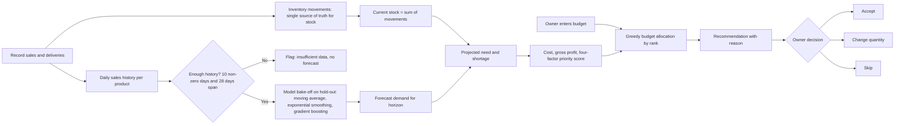
```mermaid
flowchart LR
    A["Record sales and deliveries"] --> B["Inventory movements: single source of truth for stock"]
    B --> C["Current stock = sum of movements"]
    A --> D["Daily sales history per product"]
    D --> E{"Enough history? 10 non-zero days and 28 days span"}
    E -- "No" --> F["Flag: insufficient data, no forecast"]
    E -- "Yes" --> G["Model bake-off on hold-out: moving average, exponential smoothing, gradient boosting"]
    G --> H["Forecast demand for horizon"]
    C --> I["Projected need and shortage"]
    H --> I
    I --> J["Cost, gross profit, four-factor priority score"]
    K["Owner enters budget"] --> L["Greedy budget allocation by rank"]
    J --> L
    L --> M["Recommendation with reason"]
    M --> N{"Owner decision"}
    N --> O["Accept"]
    N --> P["Change quantity"]
    N --> Q["Skip"]
```

*Note.* Author's conceptual model, derived from services/forecasting.py, services/recommendation.py and services/inventory.py.

The interface uses everyday words rather than technical ones, because the intended users are shop owners and staff and not analysts. The sidebar labels, which are Home, Record a sale, Record delivery, Stock, What to buy, Sales outlook, Products, Suppliers, Sales & deliveries and Reports, map directly onto the technical vocabulary used in this chapter. For example, a delivery is stored as a Purchase, a recommendation list is produced under the label What to buy, and a forecast is shown under the label Sales outlook. The mapping is given in Table 3.1 so that the reader can move between the screens, the report and the database without confusion. The chapter uses the technical terms in diagrams and tables and the screen terms when describing what the owner sees.

**Table 3.1**
*Mapping Between Screen Labels and Technical Terms*

| Screen label | Technical term in code | Main code element |
|---|---|---|
| Record a sale | Sale with SaleItems and sale movements | `inventory.record_sale` |
| Record delivery | Purchase with PurchaseItems and purchase movements | `inventory.record_purchase` |
| Stock | Current stock derived from InventoryMovement | `inventory.current_stock_map` |
| What to buy | RecommendationRun with Recommendation lines | `recommendation.generate_recommendation_run` |
| Sales outlook | Forecast rows | `forecasting.generate_forecasts` |
| Products running low | Stock-risk rows, status "Running low" | `recommendation.assess_stock_risk` |
| Products, Suppliers | Product, Supplier, product_suppliers | `models.py` |

*Note.* Compiled by the author from the user interface and the supplied code.

## 3.2 Systems Development Methodology

The project combines the design science research approach with Agile iterative development. Design science was selected because the research must produce a working artefact and also produce knowledge about which forecasting approach and priority model suit small shops (Hevner et al., 2004). Agile iteration was selected because the requirements about forecasting and prioritisation were refined while the prototype was being built, and small working increments allowed the author to test each idea before building the next one. The two approaches fit together naturally, since each design science stage can be carried out through one or more short development cycles. This combination also supports the supervisor's need to see steady, demonstrable progress.

The design science stages are applied to DukaSmart as shown in Table 3.2. Problem identification and objective definition were completed in Chapters 1 and 2, and they are refined here through requirements elicitation. Design and development produced the database, the services and the interface, and demonstration is done by running the prototype on seeded data. Evaluation is planned in Chapter 4 and covers forecast accuracy, functional correctness, usability and recommendation consistency under budget scenarios. Communication is achieved through this report and the project defence.

**Table 3.2**
*Design Science Stages Applied to DukaSmart*

| Stage (Peffers et al., 2007) | Activity in this project | Evidence |
|---|---|---|
| Problem identification | Define the replenishment-under-budget problem for small shops | Chapter 1 |
| Objectives of a solution | Four specific objectives and seventeen traceable functional requirements | Sections 1.5 and 3.6 |
| Design and development | Models, services, forecasting engine, recommendation engine, web interface | `models.py`, `services/`, frontend |
| Demonstration | Seeded demonstration data in a local deployment | Chapter 4 |
| Evaluation | Time-ordered hold-out, automated tests, budget scenarios, usability study | Chapter 4 |
| Communication | Project report and defence | This report |

*Note.* Stages adapted from Peffers et al. (2007). The count of functional requirements is the seventeen in Table 3.9; Chapter 4 maps tests to them.

The code itself shows that development was iterative. The priority score first used a cost-efficiency factor and was later changed to four factors, namely stockout risk, forecast demand, expected gross profit and affordability, and comments in recommendation.py describe this as an update. The profitability columns on the recommendation table were added afterwards through a migration script named migrate_profitability.py, according to a comment in models.py, and a short priority label was added next to the original full explanation. The cost-efficiency score is still computed and stored for backward compatibility even though it no longer feeds the priority score. These traces show a cycle of build, review and refine, and they justify the choice of an iterative method over a single-pass waterfall plan.

The practical cycle used for each increment had four steps. The author first wrote the rule in plain language, for example that a product is at risk when its projected need exceeds the stock on the shelf. The rule was then implemented as a small, separately testable function, such as `_need_profile`, and covered by automated tests run with pytest. The result was shown on the interface using seeded data, and the output was compared with a hand calculation. Finally, the settings that influence behaviour were moved into config.py so that they could be changed without touching the business logic.

Supporting practices were chosen to keep the work reproducible. Source code was managed with Git, and all tunable values such as the safety margin, hold-out length and priority weights live in one settings class that can be overridden by environment variables prefixed with `DUKASMART_`. The weights are checked at start-up and must sum to 1.0, otherwise the application refuses to start. Every forecast row stores the model, parameters, data window and candidate scores, and every recommendation run stores the weights it used. These practices make the research repeatable, which is a core requirement of design science.

## 3.3 Feasibility Study

### 3.3.1 Economic Feasibility

DukaSmart is economically feasible because every software component named in requirements.txt and package.json is free and open source. The backend uses FastAPI, Uvicorn, SQLAlchemy, pandas, NumPy, scikit-learn, statsmodels, PyJWT and bcrypt, and the frontend uses React, Vite, Tailwind CSS, React Router, Recharts, TanStack Query, Sonner and lucide-react. The default database is a single SQLite file, which needs no database server licence and no separate machine. The prototype runs on one ordinary computer, so a small shop does not need to buy servers. The main costs are therefore the owner's time to record transactions and the cost of a computer or phone browser that the shop may already own.

The expected benefits are mainly the avoided losses from empty shelves and from money tied up in slow stock. The system does not claim a specific monetary saving, because no field measurement has yet been made. A fair comparison of costs and benefits can only be made once real shops use the system for a period and their lost sales and stock levels are compared. Table 3.3 lists the cost items and leaves the shop-specific figures as placeholders so that no number is invented. The conclusion at this stage is that the cost of adoption is low and that the benefit can be measured in later evaluation.

**Table 3.3**
*Cost and Benefit Items for DukaSmart*

| Item | Type | Amount |
|---|---|---|
| Software licences (all components open source) | One-off | KES 0 |
| Development tools and Git | One-off | KES 0 |
| Computer or device used for development and demonstration | Existing resource | <mark style="background:yellow">[INSERT: confirm device and whether any cost applies]</mark> |
| Hosting for a real deployment | Recurring | <mark style="background:yellow">[INSERT: none for local use; add quote if hosted]</mark> |
| Internet bundle for data collection and coordination | Recurring | <mark style="background:yellow">[INSERT: amount]</mark> |
| Printing of questionnaires and consent forms | One-off | <mark style="background:yellow">[INSERT: amount]</mark> |
| Owner time to record sales and deliveries | Recurring, indirect | <mark style="background:yellow">[INSERT: minutes per day observed in the field]</mark> |
| Benefit: fewer stockouts and less idle stock | Recurring | <mark style="background:yellow">[INSERT: measured only after field use; not estimated here]</mark> |

*Note.* Author's analysis. Software costs are zero because every named library is distributed under an open-source licence.

### 3.3.2 Technical Feasibility

The project is technically feasible because the required technologies are mature and are all in use in the supplied code. The backend is written in Python with SQLAlchemy 2.0 style declarative models, and the forecasting uses pandas, NumPy, statsmodels and scikit-learn. The frontend is a React 18 single-page application built with Vite 6 and styled with Tailwind CSS 4, and charts are drawn with Recharts. Data fetching on the client uses TanStack Query, which is listed in package.json. Table 3.4 lists the stack with the minimum versions or version ranges taken from the dependency files.

**Table 3.4**
*Technology Stack and Declared Versions*

| Layer | Technology | Declared version | Role |
|---|---|---|---|
| Backend | FastAPI | >=0.115 | Web framework |
| Backend | Uvicorn | >=0.34 | Application server |
| Backend | SQLAlchemy | >=2.0 | Object-relational mapping |
| Backend | Pydantic and pydantic-settings | >=2.9 and >=2.6 | Validation and settings |
| Backend | email-validator, python-multipart | >=2.2, >=0.0.12 | Input handling |
| Backend | bcrypt | >=4.2 | Password hashing |
| Backend | PyJWT | >=2.9 | Token issue and decoding |
| Backend | pandas, NumPy | >=2.2, >=1.26 | Time-series preparation |
| Backend | scikit-learn | >=1.5 | Gradient boosting model |
| Backend | statsmodels | >=0.14 | Exponential smoothing model |
| Backend | pytest, httpx | >=8.3, >=0.27 | Automated testing |
| Frontend | React, React DOM | ^18.3.1 | User interface |
| Frontend | Vite | ^6.0.0 | Build tool and dev server |
| Frontend | Tailwind CSS and @tailwindcss/vite | ^4.0.0 | Styling |
| Frontend | React Router DOM | ^6.28.0 | Page routing |
| Frontend | TanStack React Query | ^5.62.0 | Server-state fetching |
| Frontend | Recharts | ^2.15.0 | Charts |
| Frontend | Sonner, lucide-react | ^1.7.1, ^0.468.0 | Notifications and icons |
| Database | SQLite (default URL in config.py) | Bundled with Python | Storage |

*Note.* Compiled from requirements.txt, package.json and config.py. The Vite version actually running during development was 6.4.3 according to the context pack.

The main technical risks are the quality of the sales history and the limits of SQLite under many simultaneous writers. The first risk is handled by the data-sufficiency gate, which refuses to forecast a product with fewer than 10 non-zero sales days or a history shorter than 28 days. The second risk is handled by keeping the data access in SQLAlchemy, so that the database address in config.py can be changed to PostgreSQL without rewriting the services. The code also avoids hidden state because stock is derived from movements and not stored. The author judges the project technically feasible for a single-shop prototype.

### 3.3.3 Operational Feasibility

The system is operationally feasible if the owner and staff can record sales and deliveries as they happen. The interface wording is deliberately plain, and the explanation attached to each recommendation is written as a short story, for example that the shop has a certain amount left and sales are running at a certain number a day. The workload is small because a sale or delivery is entered as one form with several product lines. The owner stays in control, since nothing is ordered automatically and each line can be accepted, changed or rejected. Staff can use the recording functions while owner-only functions such as budgets and recommendations are intended to be restricted by the role stored on each user.

The main operational risk is incomplete or late recording, because the forecasts and the stock figures are only as good as the movements entered. The system reduces this risk by refusing a sale that exceeds the stock on hand unless a negative-stock override is explicitly used, which pushes the user to record deliveries first. The usability of the interface and the time needed to record a typical day will be measured in the usability study. <mark style="background:yellow">[INSERT: n of owners or staff who judged the system easy to use, from the usability instrument in Chapter 4]</mark> These results will decide whether the operational feasibility holds in real shops. The planned usability study in Chapter 4 therefore also records how long a typical day of recording takes.

### 3.3.4 Legal, Ethical and Schedule Feasibility

The project handles business records and personal sign-in data, so data protection must be respected. Passwords are never stored in readable form, because the security module stores only a bcrypt hash and never returns it, and the sign-in token contains only a user identifier, a role and timestamps. Participants in the field study will be asked for informed consent, and their answers will be anonymised in line with the principles of the Kenyan Data Protection Act, 2019. <mark style="background:yellow">[INSERT: confirm ethics clearance, university letter of introduction and any research permit required]</mark> Where real shop records cannot be shared, seeded data are used and are openly declared as seeded. Any record shared by a shop is used only for this project and is not published with identifying details.

Schedule feasibility is not a limitation of this project, in line with the departmental guide, and the work is organised around the supervisor's milestones. The project plan and budget are given in the appendices of the final report. The schedule is therefore not discussed further in this chapter. The conclusion of the feasibility study is that the project is economically, technically and operationally feasible for a single-shop prototype, subject to confirmation of the field results. The feasibility judgement is revisited in Chapter 4 once testing and the field results are available.


## 3.4 Requirements Elicitation and Data Collection

### 3.4.1 Purpose and Design of the Data Collection

The purpose of the field study is to learn how small retail shops in Nairobi County currently record sales, monitor stock and decide what to buy, and to confirm which functions the system must provide. This directly serves the first specific objective, which is to investigate those practices and identify the information challenges that affect replenishment. The study uses a mixed-methods design in which a structured questionnaire gathers comparable, countable answers and a short interview gathers explanations that a questionnaire cannot capture. The two instruments are administered to the same type of respondent so that the results can be compared and combined. The study is descriptive and is not meant to prove cause and effect, and its findings are used to confirm, adjust or rank the requirements in Section 3.6.

No field data had been collected when this chapter was written. Everything in Sections 3.4.2 to 3.4.7 therefore describes the plan, and the results in Section 3.4.8 are left as marked placeholders. The system requirements in Section 3.6 were derived from the project objectives, the literature review and the behaviour of the working prototype, and they are to be confirmed against the field results once these exist. This honest separation protects the report from claiming evidence that has not been gathered. It also tells the examiner exactly which parts remain to be completed with real data.

### 3.4.2 Target Population and Sampling Plan

The target population is owners and attendants of small general-retail and fast-moving consumer goods shops in Nairobi County, Kenya, that sell packaged goods in whole units such as packets, bottles and tins. The unit of analysis is the shop, and one respondent who makes or influences the buying decisions is sought from each shop. The inclusion criteria are that the shop operates in Nairobi County, that it sells at least a small range of packaged goods, that the respondent takes part in restocking decisions, and that the respondent gives informed consent. Shops that are part of a large chain with central purchasing, and shops that do not buy stock for resale, are excluded because they do not face the budget-limited decision studied here. The population is therefore defined by decision-making role and by the type of goods sold, and not by the size of the premises.

The sampling technique is non-probability purposive sampling, supported by convenience and referral (snowball) recruitment, because no complete list of small shops exists from which a random sample could be drawn. Purposive selection allows the researcher to include a spread of shop types and locations within the county, for example by choosing shops from different sub-counties. Referral from one participating owner to another is used only where direct approach is difficult, and the chain of referral is recorded so that the resulting bias can be reported. The limitation of this technique is that the findings cannot be statistically generalised to all shops in Nairobi County, and this limitation is stated in the report. The planned sample size is <mark style="background:yellow">[INSERT: n planned, to be agreed with the supervisor]</mark>, and the number actually reached is <mark style="background:yellow">[INSERT: n achieved]</mark>.

The sample size is justified by the purpose of the study. The questionnaire is used to identify common practices and to rank requirements, not to estimate a population percentage with a stated margin of error, so a modest sample is accepted for requirements work. The sample is stopped when the same practices and challenges keep recurring in new interviews, which is the saturation principle applied to the qualitative part. The final justification and the stratification used are recorded as <mark style="background:yellow">[INSERT: sample size justification and any strata, e.g. number per sub-county]</mark>. A pilot of <mark style="background:yellow">[INSERT: n pilot respondents]</mark> shops, excluded from the main sample, is used to test the instruments.

### 3.4.3 Data Collection Instruments

Two instruments are used. The first is a structured questionnaire with closed questions, a few five-point Likert items and a small number of open questions, and the full draft is given in Appendix A together with its tally plan. The second is a short semi-structured interview guide, given in Appendix B, with probing questions on the same themes. The questionnaire is organised in six sections: shop profile, sales recording, stock monitoring, purchasing and budget, challenges, and expected system functions. Each question is linked to a specific research question or requirement, as shown in Table 3.5, so that no question is asked without a purpose.

The instruments were designed to be short enough to finish in about ten to fifteen minutes, because shop owners work while they answer. Questions use plain English and, where needed, may be read out in Kiswahili by the enumerator, and the wording avoids technical terms such as forecasting or inventory turnover. Closed options include "other (specify)" so that practices not anticipated by the researcher are not forced into a wrong box. The instrument will be approved by the supervisor before use, as the departmental guide requires, and the approval is recorded as <mark style="background:yellow">[INSERT: supervisor approval date]</mark>. The final length of the instrument will be confirmed after the pilot has shown how long respondents actually take.

**Table 3.5**
*Mapping of Questionnaire Sections to Objectives and Requirements*

| Section | Topic | Research question | Used to confirm |
|---|---|---|---|
| A | Shop profile (type, years trading, number of products, staff) | RQ1 | Scope and sampling description |
| B | How sales are recorded now | RQ1 | FR04, FR06, FR07 |
| C | How stock is checked and how stockouts are noticed | RQ1 | FR07, FR11 |
| D | How buying decisions and budgets are made | RQ1, RQ3 | FR08, FR09, FR13, FR14 |
| E | Challenges faced when restocking | RQ1 | Problem statement, priority of requirements |
| F | Expected functions and ranking | RQ1, RQ3 | FR15, FR16 and the ranking of requirements |

*Note.* Prepared by the author. RQ1 and RQ3 refer to the research questions in Section 1.6.

### 3.4.4 Preparation, Pilot Testing and Reliability

Preparation begins with a letter of introduction from the Department of Information Technology, a consent statement printed on the first page of each instrument, and an identifier scheme that replaces shop and respondent names with codes such as S01 and S02. The instrument is pilot tested on a small number of shops outside the main sample to check that the questions are understood, that the options are complete and that the timing is acceptable. Problems found in the pilot, such as ambiguous words or missing options, are corrected and the changes are listed. <mark style="background:yellow">[INSERT: pilot findings and changes made to the instrument]</mark> Pilot respondents are not included in the main sample, so their answers do not influence the results. The letter of introduction and the consent statement are attached to the instrument in the appendices of the final report.

Reliability and validity are addressed in simple, appropriate ways. Content validity is sought by tracing every question to a research question and by having the supervisor review the instrument. Where several Likert items measure the same idea, an internal consistency coefficient such as Cronbach's alpha will be computed in SPSS or in Excel, and the value reported as <mark style="background:yellow">[INSERT: alpha value and n]</mark>. Interviews are written up from notes on the same day so that detail is not lost, and a respondent may be asked to confirm a summary of their answers. These steps do not remove all error but they make the evidence more trustworthy.

### 3.4.5 Administration and Ethics

The instruments are administered face to face by the researcher at the shop, at a time chosen by the owner to avoid peak trading. The researcher explains the purpose, reads the consent statement, and records the answers on paper or on a phone form. Participation is voluntary, the respondent can skip any question or stop at any time, and no payment or favour is offered for taking part. No personal identifiers are written on the instrument, and the code list linking codes to shops is kept separately and deleted after analysis. The researcher records the time taken for each interview so that the length of the instrument can be reported.

Data are stored on the researcher's password-protected device and are used only for this project. Quotations from interviews, if used in the final report, are reported only as they were actually recorded and are attributed to a code such as S07 and never to a name. Participants may ask for a summary of the findings after the project. <mark style="background:yellow">[INSERT: ethics clearance reference, research permit status if required, and date of letter of introduction]</mark> Paper forms are kept in a locked place until the data have been entered and checked. After the project is examined, the paper forms and the code list are destroyed.

### 3.4.6 Data Relevant to the Objectives

The data to be collected are chosen because they help to deduce requirements. Information on how sales are recorded today shows whether the system must support entry by product line or only daily totals, which matters because the forecasting engine needs product-level history. Information on how stockouts are noticed shows whether owners rely on memory, shelf checks or books, which shapes the stock screen and the running-low alert. Information on how buying amounts and budgets are decided shows whether owners think in shillings, units or suppliers, which shapes the budget input and the explanation text. Information on challenges and expected functions allows the requirements to be ranked, and ranked requirements can be built first.

In addition to the survey, the sales records of cooperating shops are requested where owners are willing to share them. Such records, in anonymised form, can be used to test the forecasting engine on real demand patterns. If records cannot be shared, the prototype continues to use seeded data, which is declared openly in every chapter that reports results. <mark style="background:yellow">[INSERT: n shops that shared sales records, period covered, and whether anonymised]</mark> Such data would also allow the author to compare the system's forecasts with actual later sales. Shared records are handled under the same consent and anonymity rules as the questionnaire answers.

### 3.4.7 Elicitation Techniques Beyond the Survey

Three further techniques supplement the questionnaire and interview. Document analysis reviews the books or notebooks that shops already use, which shows what fields the owner already records and therefore what the forms can ask for without extra burden. Observation of a short period of trading, with permission, shows how long a sale takes and where records are lost. Prototype review lets owners comment on the screens in Section 3.9.2 and the plain-language explanations, which supports the usability objective. These techniques are optional and are used only where the owner agrees.

Observation notes are recorded on a simple form that lists the date, the activity observed and any difficulty noticed. Prototype review is carried out with the working system and a seeded dataset, and comments are written down as spoken without paraphrasing into claims. The results of these supplementary techniques are reported in the same way as the survey, with counts and codes, and are listed in Table 3.6. No result is entered until it has actually been collected. Observation is limited to what the owner agrees to, and no customer is recorded or photographed.

### 3.4.8 Field Results (to be completed)

**Table 3.6**
*Field Study Results Summary (Placeholders)*

| Item | Result |
|---|---|
| Questionnaires distributed | <mark style="background:yellow">[INSERT: n]</mark> |
| Questionnaires returned and usable | <mark style="background:yellow">[INSERT: n and response rate]</mark> |
| Interviews completed | <mark style="background:yellow">[INSERT: n]</mark> |
| Shops observed | <mark style="background:yellow">[INSERT: n]</mark> |
| Shops that shared sales records | <mark style="background:yellow">[INSERT: n]</mark> |
| Respondent roles (owner / attendant / other) | <mark style="background:yellow">[INSERT: n for each]</mark> |
| Main current recording method | <mark style="background:yellow">[INSERT: n and %]</mark> |
| Main way a stockout is noticed | <mark style="background:yellow">[INSERT: n and %]</mark> |
| Main basis for deciding what to buy | <mark style="background:yellow">[INSERT: n and %]</mark> |
| Most-ranked requested function | <mark style="background:yellow">[INSERT: function, n and %]</mark> |

*Note.* To be completed from Appendix A and B after fieldwork. No value in this table has been collected yet.

## 3.5 Data Analysis

### 3.5.1 Analysis Tools and Procedure

Quantitative data from the questionnaire will be analysed with Microsoft Excel for data entry, tallying and charts, and with SPSS where cross-tabulation or a test is needed. Each completed questionnaire is first checked for completeness and given a serial number. The data are then entered into a spreadsheet with one row per respondent and one column per question, using the codes defined in the tally plan of Appendix A. Entries are double-checked by re-entering a random <mark style="background:yellow">[INSERT: % of questionnaires re-checked]</mark> and comparing, and mistakes found are corrected before analysis starts. The cleaned sheet is saved as a separate copy so that the raw entries can always be checked.

Missing answers are not guessed. They are coded as missing and left out of the percentage for that question, and the base number of valid answers is always shown beside each result. Open answers are typed as given, read several times and grouped into categories. Respondents who gave inconsistent or clearly invalid answers are listed and handled according to a rule written before analysis, which is to retain them for the questions they answered properly. This procedure keeps the analysis transparent and repeatable.

### 3.5.2 Descriptive Statistics and Charts

The main analysis is descriptive. For each closed question the analysis reports the frequency and the percentage of valid answers, and for Likert items it also reports the median and the mode, with the mean given only as a supplement. Charts follow the departmental guide and are chosen by the kind of data: pie charts for a single-choice question with few categories, bar charts for multiple-choice or ranked data, and line charts only where a measure changes over time, for example trading volume across weeks if records are available. Each chart is captioned with its figure number and states the base number of respondents. Colours and labels are kept simple so that the charts can be read in a black-and-white printout.

Table 3.7 lists the planned outputs, linked to the section of the questionnaire that supplies the data. The figures themselves cannot be drawn until data exist, and their captions are left as placeholders in the sequence of figures of this chapter. Each row names the tool, so that the author knows in advance whether Excel is enough or SPSS is required. Where a figure depends on shared sales records, it is produced only if such records are obtained. The figure placeholders that follow reserve the numbers in the sequence so that later figures do not need renumbering. Once data exist, each placeholder is replaced by the actual chart and its base number of respondents.

**Table 3.7**
*Planned Statistical Outputs and Charts*

| Output | Data source | Tool | Chart |
|---|---|---|---|
| Profile of respondents and shops | Section A | Excel | Pie and bar |
| Current methods of recording sales | Section B | Excel | Pie |
| Methods of noticing low stock | Section C | Excel | Bar |
| Basis of buying decisions and budgeting | Section D | Excel | Bar |
| Frequency of stockouts and overstock | Section E | Excel | Bar |
| Ranking of requested functions | Section F | Excel or SPSS | Bar by mean rank |
| Relationship between shop size and recording method | Sections A and B | SPSS | Cross-tabulation |
| Weekly sales pattern from shared records | Shared records | Excel | Line |

*Note.* Analysis plan prepared by the author.

**Figure 3.2**
*Current Methods of Recording Sales (Placeholder)*

<mark style="background:yellow">[INSERT: pie chart from Section B, n valid answers]</mark>

**Figure 3.3**
*Ways Shop Owners Notice Low Stock (Placeholder)*

<mark style="background:yellow">[INSERT: bar chart from Section C, n valid answers]</mark>

**Figure 3.4**
*Ranking of Requested System Functions (Placeholder)*

<mark style="background:yellow">[INSERT: bar chart of mean rank from Section F, n valid answers]</mark>

### 3.5.3 Inferential Checks and Qualitative Analysis

Where the sample is large enough to support it, a small number of simple tests may be applied. A chi-square test of independence can check whether the recording method is associated with the size of the shop, and a non-parametric test such as the Mann-Whitney test can compare Likert scores between owners and attendants. These tests are applied only when their assumptions are met, and the p-values are reported with the sample size. If the sample is small, the report states that the data are descriptive only and does not claim statistical significance. <mark style="background:yellow">[INSERT: tests actually run, test statistics, p-values, n]</mark> Results are described as associations in this sample and are not claimed for all shops.

Interview notes and open answers are analysed by thematic analysis. The researcher reads all notes, assigns short codes to meaningful statements, groups the codes into themes such as "records kept in a notebook" or "money runs out before all stock is bought", and counts how many respondents mention each theme. Themes are checked against the notes by a second reading, and the supervisor may review a sample of coded notes. Only verbatim statements that were actually recorded may be quoted. <mark style="background:yellow">[INSERT: themes found, n respondents per theme, and approved quotations with respondent codes]</mark> A theme mentioned by only one respondent is reported as a single mention and not as a pattern.

### 3.5.4 From Findings to Requirements

The findings are used to confirm or change the requirements by a fixed rule. A requirement stays as "must have" if the evidence shows that the problem it addresses is common among respondents, and it is demoted if few respondents face the problem. A new requirement is added if a theme appears repeatedly and is not yet covered by FR01 to FR17. A conflict between what owners say and what the data show is reported openly and discussed in Chapter 4. Table 3.8 records the traceability from finding to requirement and is completed after the analysis.

**Table 3.8**
*Traceability from Field Findings to Requirements (Placeholders)*

| Finding | Evidence | Requirement affected | Change made |
|---|---|---|---|
| <mark style="background:yellow">[INSERT: finding 1]</mark> | <mark style="background:yellow">[INSERT: n and %]</mark> | <mark style="background:yellow">[INSERT: FR id]</mark> | <mark style="background:yellow">[INSERT: confirmed, ranked or added]</mark> |
| <mark style="background:yellow">[INSERT: finding 2]</mark> | <mark style="background:yellow">[INSERT: n and %]</mark> | <mark style="background:yellow">[INSERT: FR id]</mark> | <mark style="background:yellow">[INSERT: confirmed, ranked or added]</mark> |
| <mark style="background:yellow">[INSERT: finding 3]</mark> | <mark style="background:yellow">[INSERT: n and %]</mark> | <mark style="background:yellow">[INSERT: FR id]</mark> | <mark style="background:yellow">[INSERT: confirmed, ranked or added]</mark> |

*Note.* To be completed after fieldwork.


## 3.6 System Specification

### 3.6.1 Functional Requirements

The functional requirements state what the system must do, and they are traced to the code so that the report claims nothing that is not built. Table 3.9 lists the seventeen requirements from the project draft and states, for each, the code element that implements it. The last column separates what the supplied code proves from what depends on the web layer that was not supplied. A requirement marked "web layer to confirm" has its business rule in the services or models but its endpoint, screen or access check lies in files outside the supplied set. The author should confirm these entries against the routers before submission.

**Table 3.9**
*Functional Requirements and Their Implementation Evidence*

| ID | Requirement | Implementing code | Evidence status |
|---|---|---|---|
| FR01 | Secure sign-in with email and password | `security.hash_password`, `verify_password`, `create_access_token`; `User.email` unique | Rules in code; sign-in route to confirm |
| FR02 | Owner and staff roles | `UserRole` enum (owner, staff), role claim in token | Role stored and issued; enforcement in routers to confirm |
| FR03 | Maintain products | `Product` model with price, cost, lead time, active flag, supplier links | Model in code; screens to confirm |
| FR04 | Record sales | `inventory.record_sale` | Implemented |
| FR05 | Record purchases (deliveries) | `inventory.record_purchase` | Implemented |
| FR06 | Inventory movements as the source of every stock change | `InventoryMovement`, `_record_movement`, `record_adjustment`, `set_opening_stock` | Implemented |
| FR07 | Current stock derived from movements | `current_stock`, `current_stock_map` | Implemented |
| FR08 | Store unit cost and selling price | `Product.selling_price`, `default_unit_cost`, `PurchaseItem.unit_cost`, `SaleItem.unit_price_at_sale` | Implemented |
| FR09 | Owner enters a purchasing budget | `Budget` model; used by `generate_recommendation_run` | Model and use in code; entry screen to confirm |
| FR10 | Short-term demand forecasts | `forecasting.generate_forecasts`, `forecast_series` | Implemented |
| FR11 | Identify products needing replenishment | `assess_stock_risk`, `_need_profile` | Implemented |
| FR12 | Expected gross profit | `gross_profit_per_unit`, `expected_gross_profit` in the run | Implemented |
| FR13 | Four-factor priority score | Weighted sum in `generate_recommendation_run`; weights in `config.py` | Implemented |
| FR14 | Budget-constrained purchase plan | Greedy allocation loop, `budget_constrained` flag | Implemented |
| FR15 | Explanation per recommendation | `_explain` (reason) and `_priority_label` (priority_reason) | Implemented |
| FR16 | Accept, change quantity or skip | `apply_decision` with statuses accepted, modified, rejected | Implemented |
| FR17 | Retain recommendations for review | `RecommendationRun`, `Recommendation` rows with weights used | Implemented |

*Note.* Requirement wording from the project draft; evidence compiled by the author from the supplied code. The screen label "skip" corresponds to the stored status `rejected`.

### 3.6.2 Business Rules Implemented in Code

Several rules govern how the functions behave, and they are fixed in the services and in config.py. They are listed in Table 3.10 because they define the observable behaviour that Chapter 4 will test. The values are defaults that can be overridden through environment variables with the prefix `DUKASMART_`. Quantities are whole units such as packets, bottles and tins, and money is stored with two decimals but handled as floating-point numbers in Python. The models file itself notes that a production system dealing with real cash should switch to a decimal type.

**Table 3.10**
*Business Rules and Default Settings*

| Rule | Default | Source |
|---|---|---|
| Minimum days with a non-zero sale before forecasting | 10 | `min_nonzero_observations` |
| Minimum span of sales history | 28 days | `min_history_days` |
| Hold-out window for scoring models | 14 days, capped at 30% of history and leaving at least 21 training days | `holdout_days`, `forecast_series` |
| Default forecast horizon | 14 days; the interface offers 7, 14 and 30 | `default_horizon_days`, `allowed_horizons` |
| Safety margin on demand | 20% | `default_safety_margin_pct` |
| Priority weights: stockout risk, forecast demand, expected gross profit, affordability | 0.40, 0.30, 0.20, 0.10, must sum to 1.0 | `weight_*` settings, checked at start-up |
| Access token lifetime | 12 hours (720 minutes) | `access_token_expire_minutes` |
| Password length | 8 characters minimum, 72 bytes maximum | `security.py` |
| Sale larger than stock | Rejected unless the negative-stock override is set | `record_sale` |
| Adjustment below zero stock | Rejected unless the override is set | `record_adjustment` |
| Product with no known unit cost | Skipped from recommendations | `generate_recommendation_run` |
| Budget of zero or less | Run refused | `generate_recommendation_run` |

*Note.* Values taken from config.py, security.py and the services.

### 3.6.3 Non-Functional Requirements

The non-functional requirements describe how well the system must perform its functions. Table 3.11 states each requirement together with the design element that supports it. Requirements for which the supplied code gives no proof, such as response time and screen appeal, are stated as targets to be measured in Chapter 4 and not as achievements. This avoids claiming performance that has not been tested. The security items rest on the security module and on the settings file, while the integrity items rest on the models.

**Table 3.11**
*Non-Functional Requirements*

| Quality | Requirement | Design support |
|---|---|---|
| Usability | Plain-language labels and explanations for non-technical owners | Sidebar labels; `_explain` text; short priority label |
| Performance | Lists and forecasts for a shop of a few dozen products appear without noticeable delay | Batch queries (`current_stock_map`, `build_series_map`); target to be measured in Chapter 4 |
| Security | No plain-text passwords; signed time-limited tokens; owner-only budget and recommendation functions | bcrypt hash; JWT HS256; role claim; owner-only enforcement to confirm in routers |
| Reliability | Stock cannot change without a record, and a failed save leaves no partial data | Derived stock; `db.begin_nested()` savepoints |
| Data integrity | Valid references and values | Foreign keys, check constraints, unique keys, input validation in services |
| Maintainability | Changes to rules without editing logic | Settings class; separation into models, services, routers, schemas |
| Scalability | Path from one shop on SQLite to a larger database | SQLAlchemy abstraction; the database address is a setting |
| Explainability | Every recommendation can be justified to the owner | Stored `reason`, `priority_reason`, score components and `weights_used` |
| Reproducibility | A forecast can be re-run and audited | Stored model parameters, data window, observation counts, candidate scores, fixed random seed 42 |

*Note.* Compiled by the author from the supplied code.

## 3.7 Requirements Analysis and Modelling

### 3.7.1 Dependencies and Conflicts Between Requirements

The requirements depend on one another in a clear order, and this order shapes the build sequence. Recording of sales and deliveries (FR04, FR05) depends on products (FR03) and produces movements (FR06), and stock (FR07) depends on movements. Forecasting (FR10) depends on recorded sales over several weeks, so a new shop gets no forecast until enough history exists. The priority score and the purchase plan (FR13, FR14) depend on the forecast, the stock, the costs and the budget (FR08, FR09, FR10, FR11), and the explanation and the decision (FR15, FR16, FR17) depend on the plan. If any earlier link is missing, the later outputs are simply not produced for that product, and the run counts the skipped products.

Some requirements conflict and the design resolves them explicitly, as listed in Table 3.12. Strict stock checking conflicts with the reality that goods are sometimes sold before the delivery is recorded, and the design answers this with a rejection by default and an explicit override. Simplicity for the owner conflicts with the accuracy of a more complex forecast, and the design answers with a model competition that ties toward the simpler model. Fairness among products conflicts with a limited budget, and the design answers with a transparent greedy rule. Auditability conflicts with ease of correction, and the design answers by never editing movements and by correcting through new adjustment records.

**Table 3.12**
*Requirement Conflicts and Design Resolutions*

| Conflict | Resolution in the design |
|---|---|
| Strict stock check versus late recording of deliveries | Sales beyond stock are rejected with a plain message; an override flag exists for deliberate exceptions |
| Simple models versus accuracy | Three models compete on a time-ordered hold-out; results within 1% of the best go to the simpler model |
| Many needs versus a limited budget | Priority ranking and top-down greedy allocation with partial funding |
| Audit trail versus correcting mistakes | Movements are append-only; corrections are new adjustment movements |
| Rich analytics versus small-shop data | A sufficiency gate returns "insufficient data" instead of a doubtful number |

*Note.* Author's analysis based on inventory.py and forecasting.py.

### 3.7.2 Context Diagram

The context diagram in Figure 3.5 shows DukaSmart as one process with the people who use it and the data that cross the boundary. The two external entities are the shop owner and shop staff. The owner enters the budget and the product economics, requests recommendations and decides on each line, while staff record sales and deliveries. The system returns stock levels, forecasts, recommendations with reasons and reports. The diagram shows no payment provider, no supplier system and no accounting package, because these are outside the scope and the code contains no such interfaces.

**Figure 3.5**
*Context Diagram of DukaSmart*

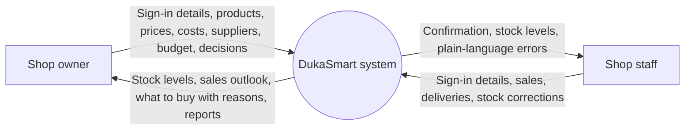
```mermaid
flowchart LR
    OWN["Shop owner"]
    STF["Shop staff"]
    SYS(("DukaSmart system"))
    OWN -- "Sign-in details, products, prices, costs, suppliers, budget, decisions" --> SYS
    SYS -- "Stock levels, sales outlook, what to buy with reasons, reports" --> OWN
    STF -- "Sign-in details, sales, deliveries, stock corrections" --> SYS
    SYS -- "Confirmation, stock levels, plain-language errors" --> STF
```

*Note.* Author's design. The staff role is intended to have limited access; the enforcement lies in the router layer that was not supplied.

### 3.7.3 Level 0 Data Flow Diagram

The Level 0 diagram in Figure 3.6 divides the system into six processes and eight data stores that correspond to groups of tables. Authentication reads the user store, and master data maintenance writes products and suppliers. Transaction recording writes sales, purchases and inventory movements, and the forecasting process reads sales and writes forecasts. The recommendation process reads stock, forecasts, costs and the budget and writes recommendation runs, and the decision process updates the recommendation lines. No process changes stock except the recording process, which reflects the rule that stock is only ever derived from movements.

**Figure 3.6**
*Level 0 Data Flow Diagram*

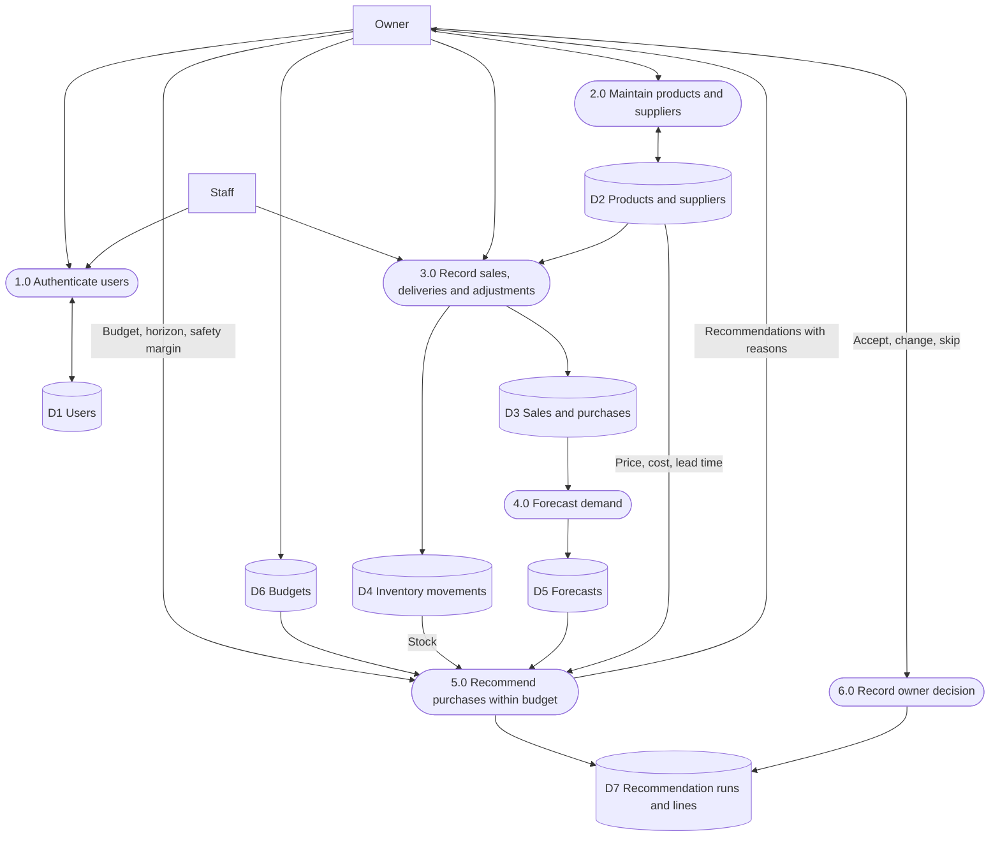
```mermaid
flowchart TB
    OWN["Owner"]
    STF["Staff"]
    P1(["1.0 Authenticate users"])
    P2(["2.0 Maintain products and suppliers"])
    P3(["3.0 Record sales, deliveries and adjustments"])
    P4(["4.0 Forecast demand"])
    P5(["5.0 Recommend purchases within budget"])
    P6(["6.0 Record owner decision"])
    D1[("D1 Users")]
    D2[("D2 Products and suppliers")]
    D3[("D3 Sales and purchases")]
    D4[("D4 Inventory movements")]
    D5[("D5 Forecasts")]
    D6[("D6 Budgets")]
    D7[("D7 Recommendation runs and lines")]
    OWN --> P1
    STF --> P1
    P1 <--> D1
    OWN --> P2
    P2 <--> D2
    STF --> P3
    OWN --> P3
    P3 --> D3
    P3 --> D4
    D2 --> P3
    D3 --> P4
    P4 --> D5
    OWN -- "Budget, horizon, safety margin" --> P5
    OWN --> D6
    D6 --> P5
    D4 -- "Stock" --> P5
    D5 --> P5
    D2 -- "Price, cost, lead time" --> P5
    P5 --> D7
    P5 -- "Recommendations with reasons" --> OWN
    OWN -- "Accept, change, skip" --> P6
    P6 --> D7
```

*Note.* Author's design from models.py and the services. D3 groups the Sale, SaleItem, Purchase and PurchaseItem tables.

### 3.7.4 Level 1 Data Flow Diagrams

Level 1 decomposes the two processes that carry the most logic. Figure 3.7 breaks down process 3.0, the recording of a transaction, into validation, header creation, line creation, movement creation and total update. The validation step checks that the transaction has lines, that the products exist, that quantities are positive, that prices and costs are not negative and, for sales, that stock is sufficient. All writes happen inside one savepoint, so either the whole transaction is stored or none of it is. The movement step stores a signed quantity and a snapshot of the resulting stock.

**Figure 3.7**
*Level 1 Data Flow Diagram for Process 3.0, Record Transactions*

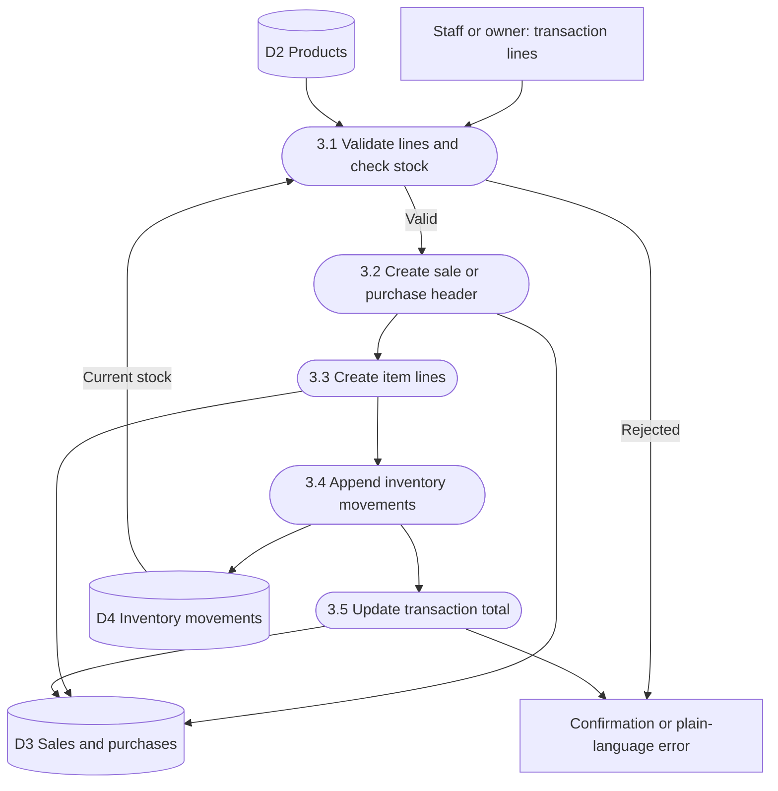
```mermaid
flowchart TB
    IN["Staff or owner: transaction lines"]
    V(["3.1 Validate lines and check stock"])
    H(["3.2 Create sale or purchase header"])
    L(["3.3 Create item lines"])
    M(["3.4 Append inventory movements"])
    T(["3.5 Update transaction total"])
    DP[("D2 Products")]
    DT[("D3 Sales and purchases")]
    DM[("D4 Inventory movements")]
    OUT["Confirmation or plain-language error"]
    IN --> V
    DP --> V
    DM -- "Current stock" --> V
    V -- "Rejected" --> OUT
    V -- "Valid" --> H
    H --> DT
    H --> L
    L --> DT
    L --> M
    M --> DM
    M --> T
    T --> DT
    T --> OUT
```

*Note.* Author's design from `record_sale` and `record_purchase`.

Figure 3.8 breaks down process 5.0, the production of a purchase plan. The process first optionally refreshes the forecasts, then loads active products with their stock, latest forecast and latest unit cost. It calculates the need profile and drops any product that is not short, any product without a usable forecast and any product with no known cost. The remaining candidates are scored, ranked and funded from the budget in order, and each result is written with its explanation. The owner receives the run and its lines.

**Figure 3.8**
*Level 1 Data Flow Diagram for Process 5.0, Recommend Purchases*

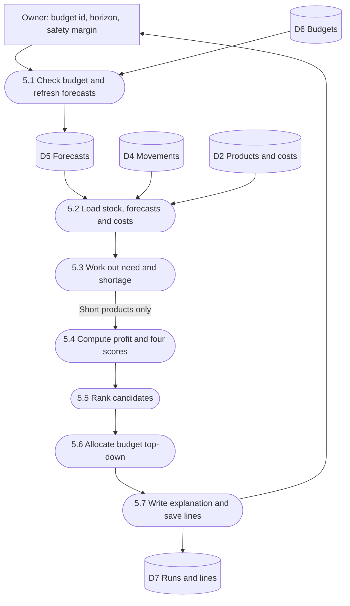
```mermaid
flowchart TB
    OWN["Owner: budget id, horizon, safety margin"]
    A(["5.1 Check budget and refresh forecasts"])
    B(["5.2 Load stock, forecasts and costs"])
    C(["5.3 Work out need and shortage"])
    D(["5.4 Compute profit and four scores"])
    E(["5.5 Rank candidates"])
    F(["5.6 Allocate budget top-down"])
    G(["5.7 Write explanation and save lines"])
    DB[("D6 Budgets")]
    DF[("D5 Forecasts")]
    DM[("D4 Movements")]
    DP[("D2 Products and costs")]
    DR[("D7 Runs and lines")]
    OWN --> A
    DB --> A
    A --> DF
    DF --> B
    DM --> B
    DP --> B
    B --> C
    C -- "Short products only" --> D
    D --> E
    E --> F
    F --> G
    G --> DR
    G --> OWN
```

*Note.* Author's design from `generate_recommendation_run`.

### 3.7.5 Use Case Model

The use case diagram in Figure 3.9 shows the actors and the functions they can start. The owner can do everything, and staff are intended to record sales and deliveries and to view stock. The restriction of budgets and recommendations to the owner follows the project draft and the role stored on each user, but the enforcing code is in the router layer that was not supplied. Sign-in is shared by both actors, and every other use case requires a valid token. The relationship of generating recommendations to updating forecasts is shown as an inclusion, because the run refreshes forecasts by default.

**Figure 3.9**
*Use Case Diagram of DukaSmart*

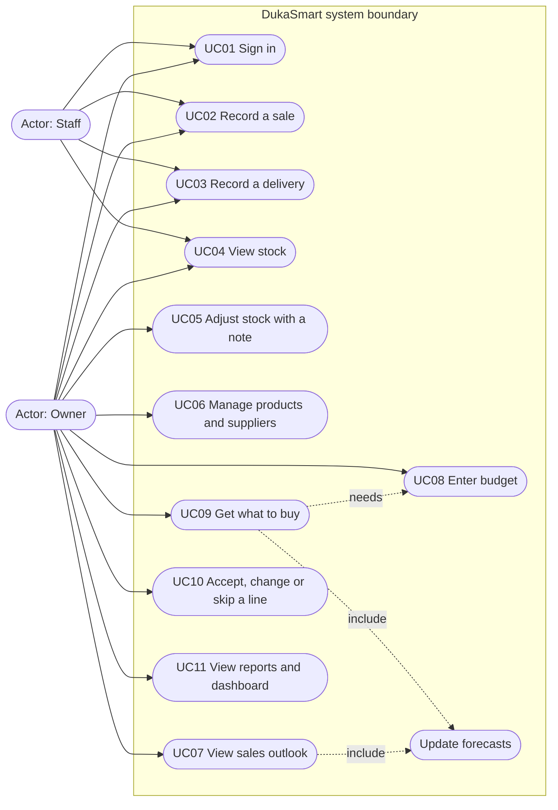
```mermaid
flowchart LR
    OWN(["Actor: Owner"])
    STF(["Actor: Staff"])
    subgraph SYS["DukaSmart system boundary"]
        UC1(["UC01 Sign in"])
        UC2(["UC02 Record a sale"])
        UC3(["UC03 Record a delivery"])
        UC4(["UC04 View stock"])
        UC5(["UC05 Adjust stock with a note"])
        UC6(["UC06 Manage products and suppliers"])
        UC7(["UC07 View sales outlook"])
        UC8(["UC08 Enter budget"])
        UC9(["UC09 Get what to buy"])
        UC10(["UC10 Accept, change or skip a line"])
        UC11(["UC11 View reports and dashboard"])
        UC7B(["Update forecasts"])
    end
    STF --> UC1
    STF --> UC2
    STF --> UC3
    STF --> UC4
    OWN --> UC1
    OWN --> UC2
    OWN --> UC3
    OWN --> UC4
    OWN --> UC5
    OWN --> UC6
    OWN --> UC7
    OWN --> UC8
    OWN --> UC9
    OWN --> UC10
    OWN --> UC11
    UC9 -. "include" .-> UC7B
    UC9 -. "needs" .-> UC8
    UC7 -. "include" .-> UC7B
```

*Note.* Author's design. Which roles may use UC05 to UC11 is to be confirmed in the router layer.

Table 3.13 gives the descriptions of the three central use cases. They are the ones that carry the research contribution and they are the subject of the sequence diagrams in Section 3.8.2. The pre-conditions and post-conditions are taken from the checks in the services. Alternative flows are the rejections the code produces, written in the plain language the code uses. UC09 is the use case that realises the third specific objective.

**Table 3.13**
*Description of Key Use Cases*

| Item | UC02 Record a sale | UC09 Get what to buy | UC10 Accept, change or skip |
|---|---|---|---|
| Actor | Staff or owner | Owner | Owner |
| Pre-condition | Signed in; products exist; stock available | Signed in; a budget above zero exists | A recommendation line exists |
| Main flow | Choose date and product lines; the system validates, stores the sale, items and movements | The system refreshes forecasts, scores short products, ranks them and allocates the budget | Choose accept, change quantity or skip; the system stores status, quantity and time |
| Alternative flow | Quantity above stock rejected; non-positive quantity rejected; negative price rejected | Budget not found or not above zero is refused; products with no forecast or cost are counted and skipped | Change without a quantity is refused; negative quantity is refused |
| Post-condition | Stock reduced by sale movements | A run with ranked lines is stored | Line status and the operator quantity are saved |

*Note.* Derived by the author from `inventory.py` and `recommendation.py`.

### 3.7.6 Conceptual Class Diagram

The conceptual class diagram in Figure 3.10 shows the business ideas of the domain and the relationships between them, without implementation detail. A user records sales, deliveries and budgets, and a delivery comes from a supplier. Each sale and each delivery has item lines for products, and each line produces a stock movement. A product is forecast and recommended, and a recommendation belongs to a run that is tied to one budget. The code has no shop entity, which agrees with the single-shop scope of the project.

**Figure 3.10**
*Conceptual Class Diagram*

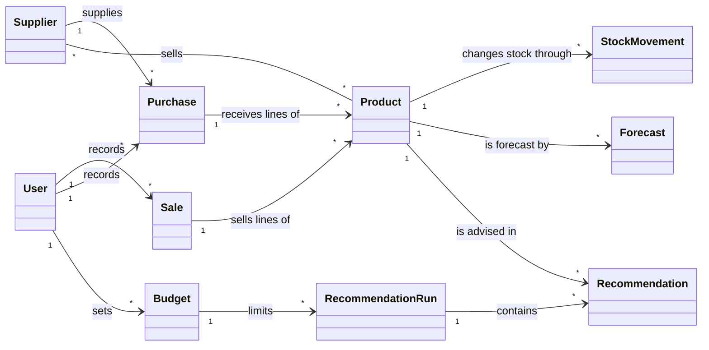
```mermaid
classDiagram
    direction LR
    class User
    class Supplier
    class Product
    class Sale
    class Purchase
    class StockMovement
    class Forecast
    class Budget
    class RecommendationRun
    class Recommendation
    User "1" --> "*" Sale : records
    User "1" --> "*" Purchase : records
    User "1" --> "*" Budget : sets
    Supplier "1" --> "*" Purchase : supplies
    Supplier "*" -- "*" Product : sells
    Sale "1" --> "*" Product : sells lines of
    Purchase "1" --> "*" Product : receives lines of
    Product "1" --> "*" StockMovement : changes stock through
    Product "1" --> "*" Forecast : is forecast by
    Budget "1" --> "*" RecommendationRun : limits
    RecommendationRun "1" --> "*" Recommendation : contains
    Product "1" --> "*" Recommendation : is advised in
```

*Note.* Author's conceptual model derived from models.py.

### 3.7.7 Analysis Class Diagram

The analysis class diagram in Figure 3.11 adds the responsibilities that realise the use cases, using the boundary, control and entity stereotypes. Boundary classes are the screens the owner sees, control classes are the service modules that apply the rules, and entity classes are the stored records. The control classes carry the operations named in the code, such as `record_sale`, `forecast_series`, `generate_recommendation_run` and `apply_decision`. This view connects the screens to the rules and the rules to the data, and it prepares the design class diagram of Section 3.8.1. The pages are shown as boundary classes because they are the only classes the owner touches directly.

**Figure 3.11**
*Analysis Class Diagram*

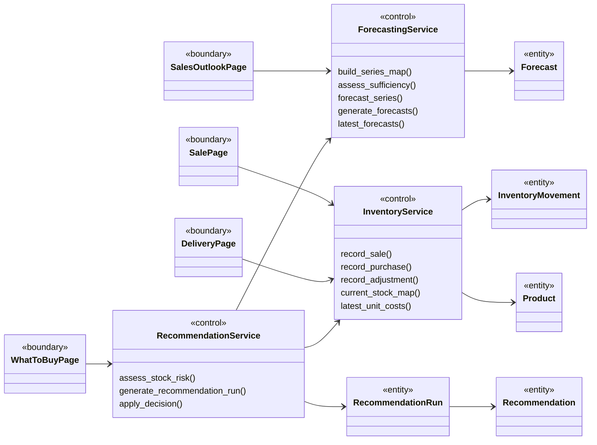
```mermaid
classDiagram
    direction LR
    class SalePage {
        <<boundary>>
    }
    class DeliveryPage {
        <<boundary>>
    }
    class WhatToBuyPage {
        <<boundary>>
    }
    class SalesOutlookPage {
        <<boundary>>
    }
    class InventoryService {
        <<control>>
        record_sale()
        record_purchase()
        record_adjustment()
        current_stock_map()
        latest_unit_costs()
    }
    class ForecastingService {
        <<control>>
        build_series_map()
        assess_sufficiency()
        forecast_series()
        generate_forecasts()
        latest_forecasts()
    }
    class RecommendationService {
        <<control>>
        assess_stock_risk()
        generate_recommendation_run()
        apply_decision()
    }
    class Product {
        <<entity>>
    }
    class InventoryMovement {
        <<entity>>
    }
    class Forecast {
        <<entity>>
    }
    class RecommendationRun {
        <<entity>>
    }
    class Recommendation {
        <<entity>>
    }
    SalePage --> InventoryService
    DeliveryPage --> InventoryService
    SalesOutlookPage --> ForecastingService
    WhatToBuyPage --> RecommendationService
    RecommendationService --> ForecastingService
    RecommendationService --> InventoryService
    InventoryService --> InventoryMovement
    InventoryService --> Product
    ForecastingService --> Forecast
    RecommendationService --> RecommendationRun
    RecommendationRun --> Recommendation
```

*Note.* Author's analysis model. The pages call the services through the router layer, which was not supplied.


## 3.8 Logical Design

### 3.8.1 System Architecture

DukaSmart follows a client-server architecture with a layered backend. The browser runs a React single-page application that talks to a FastAPI backend over HTTP, and the backend reads and writes a SQLite database through SQLAlchemy. Inside the backend the code is separated into models, services and, according to the project draft, routers and schemas. The services hold all business rules, so the same rule is never written twice, and the models describe the stored data. This layering keeps each concern in one place, which makes the system easier to test, change and explain.

Figure 3.12 shows the layers and the main modules in each. The presentation layer contains the pages that match the sidebar labels, the TanStack Query data fetching, and the Recharts charts. The application layer contains the web routes and request validation, which were not part of the supplied files. The domain layer contains the three service modules and the settings, and the data layer contains the SQLAlchemy models and the database. Security cuts across the layers through the password hashing and token module.

**Figure 3.12**
*Layered Architecture of DukaSmart*

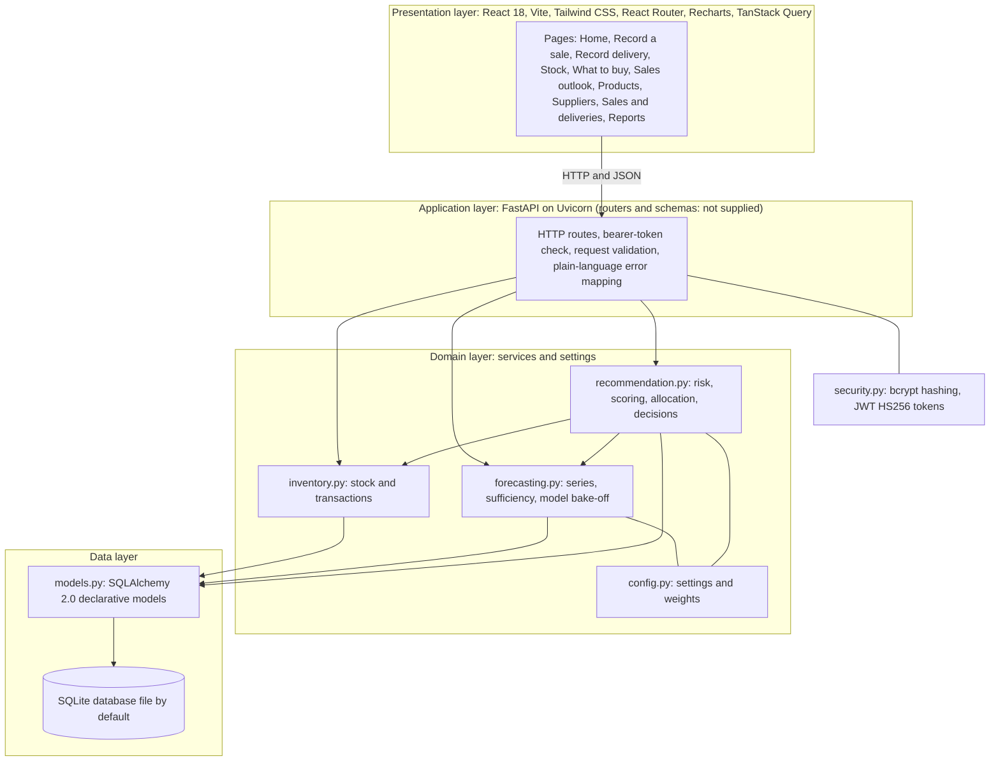
```mermaid
flowchart TB
    subgraph L1["Presentation layer: React 18, Vite, Tailwind CSS, React Router, Recharts, TanStack Query"]
        U1["Pages: Home, Record a sale, Record delivery, Stock, What to buy, Sales outlook, Products, Suppliers, Sales and deliveries, Reports"]
    end
    subgraph L2["Application layer: FastAPI on Uvicorn (routers and schemas: not supplied)"]
        A1["HTTP routes, bearer-token check, request validation, plain-language error mapping"]
    end
    subgraph L3["Domain layer: services and settings"]
        S1["inventory.py: stock and transactions"]
        S2["forecasting.py: series, sufficiency, model bake-off"]
        S3["recommendation.py: risk, scoring, allocation, decisions"]
        S4["config.py: settings and weights"]
    end
    subgraph L4["Data layer"]
        M1["models.py: SQLAlchemy 2.0 declarative models"]
        DB[("SQLite database file by default")]
    end
    SEC["security.py: bcrypt hashing, JWT HS256 tokens"]
    U1 -- "HTTP and JSON" --> A1
    A1 --> S1
    A1 --> S2
    A1 --> S3
    S3 --> S2
    S3 --> S1
    S1 --> M1
    S2 --> M1
    S3 --> M1
    M1 --> DB
    A1 --- SEC
    S2 --- S4
    S3 --- S4
```

*Note.* Author's design from the supplied code and package.json.

The component diagram in Figure 3.13 shows the deployable parts and the dependencies between them. The forecasting component depends on pandas and NumPy for series preparation, on statsmodels for exponential smoothing and on scikit-learn for gradient boosting. The recommendation component depends on the forecasting component for the latest forecasts and on the inventory component for stock and costs. The inventory component depends only on the models. The security component depends on bcrypt and PyJWT and reads its secret and token lifetime from the settings component.

**Figure 3.13**
*Component Diagram of DukaSmart*

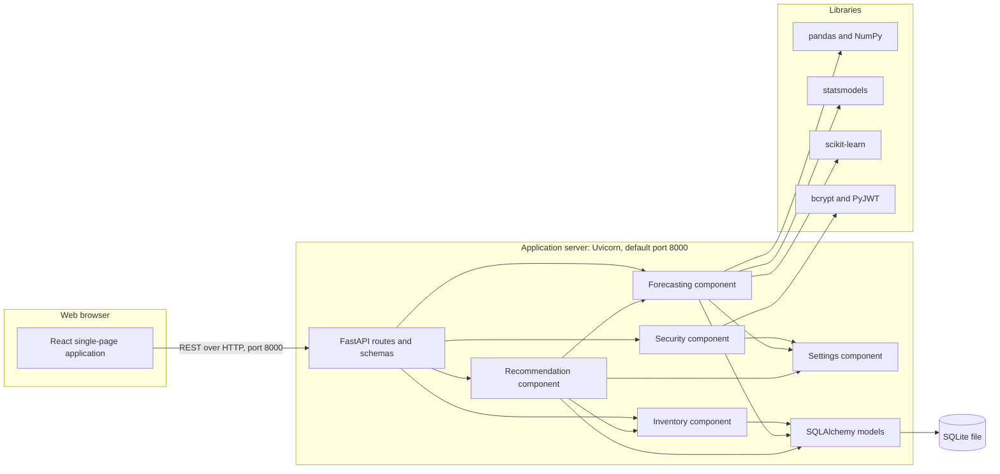
```mermaid
flowchart LR
    subgraph Client["Web browser"]
        SPA["React single-page application"]
    end
    subgraph Server["Application server: Uvicorn, default port 8000"]
        API["FastAPI routes and schemas"]
        INV["Inventory component"]
        FOR["Forecasting component"]
        REC["Recommendation component"]
        SECM["Security component"]
        CFG["Settings component"]
        ORM["SQLAlchemy models"]
    end
    subgraph Libs["Libraries"]
        PD["pandas and NumPy"]
        SM["statsmodels"]
        SK["scikit-learn"]
        BC["bcrypt and PyJWT"]
    end
    DB[("SQLite file")]
    SPA -- "REST over HTTP, port 8000" --> API
    API --> INV
    API --> FOR
    API --> REC
    API --> SECM
    REC --> FOR
    REC --> INV
    FOR --> PD
    FOR --> SM
    FOR --> SK
    SECM --> BC
    SECM --> CFG
    FOR --> CFG
    REC --> CFG
    INV --> ORM
    FOR --> ORM
    REC --> ORM
    ORM --> DB
```

*Note.* The development frontend runs on port 5173 and the backend on port 8000, according to the project notes. Author's design.

The design class diagram in Figure 3.14 shows the persistent classes with their key attributes and the three enumerations. It is derived from models.py, and relationships follow the foreign keys. The Product class has no stock attribute, and this absence is deliberate, because stock is derived from the movement class. A recommendation links to a run, a product and, optionally, the forecast that fed it. The Forecast class carries the reproducibility fields, namely the data window, the number of observations, the number of non-zero observations and the candidate scores.

**Figure 3.14**
*Design Class Diagram of the Persistent Classes*

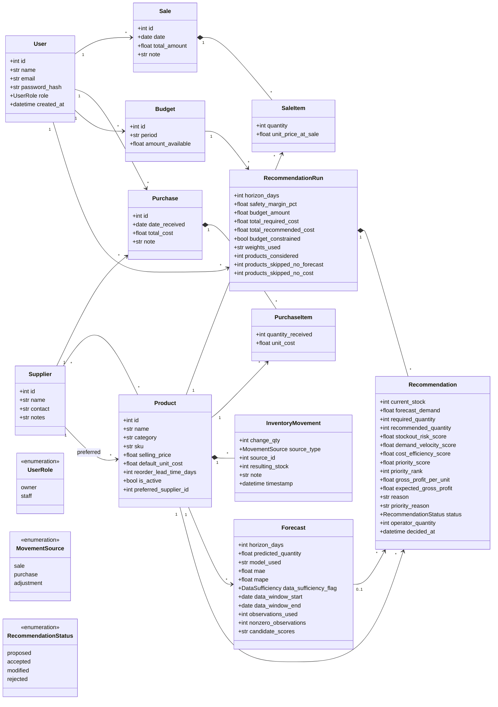
```mermaid
classDiagram
    direction LR
    class User {
        +int id
        +str name
        +str email
        +str password_hash
        +UserRole role
        +datetime created_at
    }
    class Supplier {
        +int id
        +str name
        +str contact
        +str notes
    }
    class Product {
        +int id
        +str name
        +str category
        +str sku
        +float selling_price
        +float default_unit_cost
        +int reorder_lead_time_days
        +bool is_active
        +int preferred_supplier_id
    }
    class Sale {
        +int id
        +date date
        +float total_amount
        +str note
    }
    class SaleItem {
        +int quantity
        +float unit_price_at_sale
    }
    class Purchase {
        +int id
        +date date_received
        +float total_cost
        +str note
    }
    class PurchaseItem {
        +int quantity_received
        +float unit_cost
    }
    class InventoryMovement {
        +int change_qty
        +MovementSource source_type
        +int source_id
        +int resulting_stock
        +str note
        +datetime timestamp
    }
    class Forecast {
        +int horizon_days
        +float predicted_quantity
        +str model_used
        +float mae
        +float mape
        +DataSufficiency data_sufficiency_flag
        +date data_window_start
        +date data_window_end
        +int observations_used
        +int nonzero_observations
        +str candidate_scores
    }
    class Budget {
        +int id
        +str period
        +float amount_available
    }
    class RecommendationRun {
        +int horizon_days
        +float safety_margin_pct
        +float budget_amount
        +float total_required_cost
        +float total_recommended_cost
        +bool budget_constrained
        +str weights_used
        +int products_considered
        +int products_skipped_no_forecast
        +int products_skipped_no_cost
    }
    class Recommendation {
        +int current_stock
        +float forecast_demand
        +int required_quantity
        +int recommended_quantity
        +float stockout_risk_score
        +float demand_velocity_score
        +float cost_efficiency_score
        +float priority_score
        +int priority_rank
        +float gross_profit_per_unit
        +float expected_gross_profit
        +str reason
        +str priority_reason
        +RecommendationStatus status
        +int operator_quantity
        +datetime decided_at
    }
    class UserRole {
        <<enumeration>>
        owner
        staff
    }
    class MovementSource {
        <<enumeration>>
        sale
        purchase
        adjustment
    }
    class RecommendationStatus {
        <<enumeration>>
        proposed
        accepted
        modified
        rejected
    }
    User "1" --> "*" Sale
    User "1" --> "*" Purchase
    User "1" --> "*" Budget
    User "1" --> "*" RecommendationRun
    Supplier "1" --> "*" Purchase
    Supplier "*" -- "*" Product
    Supplier "1" --> "*" Product : preferred
    Sale "1" *-- "*" SaleItem
    Purchase "1" *-- "*" PurchaseItem
    Product "1" --> "*" SaleItem
    Product "1" --> "*" PurchaseItem
    Product "1" *-- "*" InventoryMovement
    Product "1" --> "*" Forecast
    Budget "1" --> "*" RecommendationRun
    RecommendationRun "1" *-- "*" Recommendation
    Product "1" --> "*" Recommendation
    Forecast "0..1" --> "*" Recommendation
```

*Note.* Derived from models.py. The enumerations are stored as text.

### 3.8.2 Control Flow and Process Design

#### Sign-in and Authenticated Requests

Figure 3.15 shows the sign-in sequence. The browser sends the email and password to the sign-in route, the route looks up the user by email, and the security module compares the password with the stored bcrypt hash. A malformed stored hash is treated as a failed login and never as success. On success the module issues an HS256 token that carries the user identifier, the role, the issue time and an expiry 12 hours later, and the token is returned with its lifetime in seconds. The browser then sends the token as a bearer token on later requests, and the backend decodes it with the same secret before serving them. The route code is not part of the supplied files, so the user lookup step is shown as the route's responsibility.

**Figure 3.15**
*Sequence Diagram for Sign-in*

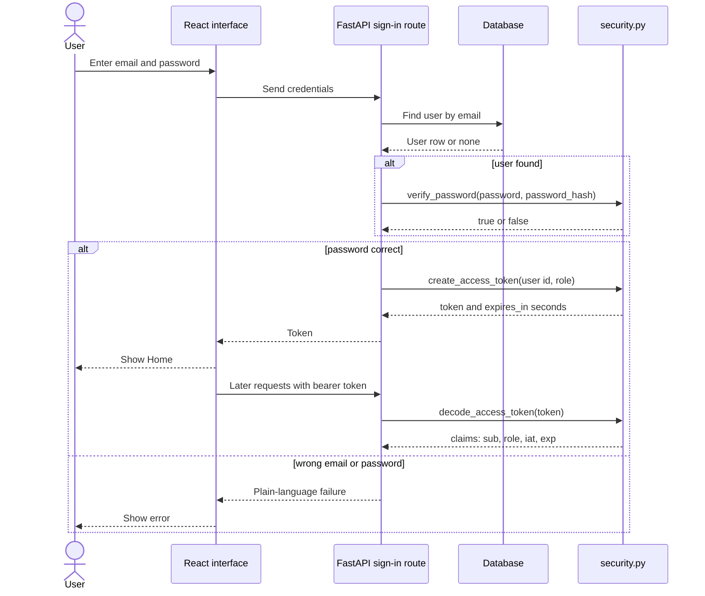
```mermaid
sequenceDiagram
    actor U as User
    participant UI as React interface
    participant API as FastAPI sign-in route
    participant DB as Database
    participant SEC as security.py
    U->>UI: Enter email and password
    UI->>API: Send credentials
    API->>DB: Find user by email
    DB-->>API: User row or none
    alt user found
        API->>SEC: verify_password(password, password_hash)
        SEC-->>API: true or false
    end
    alt password correct
        API->>SEC: create_access_token(user id, role)
        SEC-->>API: token and expires_in seconds
        API-->>UI: Token
        UI-->>U: Show Home
        UI->>API: Later requests with bearer token
        API->>SEC: decode_access_token(token)
        SEC-->>API: claims: sub, role, iat, exp
    else wrong email or password
        API-->>UI: Plain-language failure
        UI-->>U: Show error
    end
```

*Note.* Author's design from security.py. The route and the exact error wording are in files not supplied.

#### Record a Sale

Figure 3.16 shows how a sale is stored. The service loads the products, reads their current stock in one grouped query, and validates every line before writing anything. A line is rejected if its quantity is not positive, if its price is negative, or, unless the negative-stock override is set, if the quantity is more than the stock on hand. All writes then occur inside a savepoint: the sale header is stored and flushed to obtain its identifier, each item and its negative movement are added, and the total is rounded to two decimals. If any step fails, the savepoint is rolled back and no part of the sale remains. The outer transaction is committed by the caller, which is outside the supplied files.

**Figure 3.16**
*Sequence Diagram for Record a Sale*

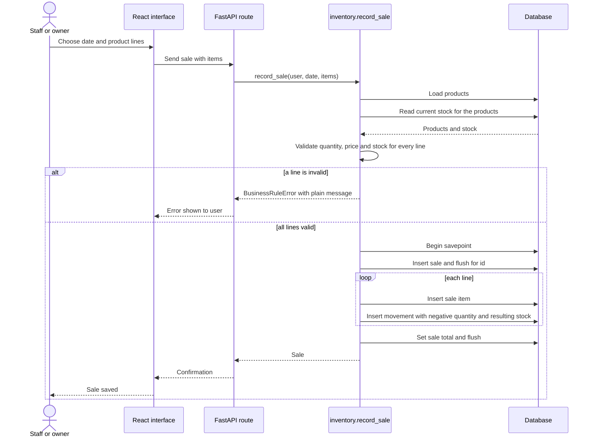
```mermaid
sequenceDiagram
    actor S as Staff or owner
    participant UI as React interface
    participant API as FastAPI route
    participant INV as inventory.record_sale
    participant DB as Database
    S->>UI: Choose date and product lines
    UI->>API: Send sale with items
    API->>INV: record_sale(user, date, items)
    INV->>DB: Load products
    INV->>DB: Read current stock for the products
    DB-->>INV: Products and stock
    INV->>INV: Validate quantity, price and stock for every line
    alt a line is invalid
        INV-->>API: BusinessRuleError with plain message
        API-->>UI: Error shown to user
    else all lines valid
        INV->>DB: Begin savepoint
        INV->>DB: Insert sale and flush for id
        loop each line
            INV->>DB: Insert sale item
            INV->>DB: Insert movement with negative quantity and resulting stock
        end
        INV->>DB: Set sale total and flush
        INV-->>API: Sale
        API-->>UI: Confirmation
        UI-->>S: Sale saved
    end
```

*Note.* Author's design from `record_sale` in inventory.py.

#### Generate Recommendations

Figure 3.17 shows the longest sequence. After the owner chooses a budget, horizon and safety margin, the service loads the budget and refuses a missing budget or one that is not above zero. Inside a savepoint it refreshes the forecasts if asked, reads the active products with their stock, latest forecasts and latest costs, and builds the candidate list. It then scores, ranks and allocates, stores the run and one line per candidate with its explanation, and flushes. The route then returns the run, and a comment in the code states that the total expected gross profit is derived from the stored lines in the planning router rather than stored on the run.

**Figure 3.17**
*Sequence Diagram for Generate Recommendations*

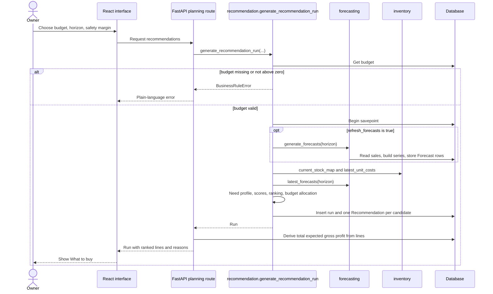
```mermaid
sequenceDiagram
    actor O as Owner
    participant UI as React interface
    participant API as FastAPI planning route
    participant REC as recommendation.generate_recommendation_run
    participant FOR as forecasting
    participant INV as inventory
    participant DB as Database
    O->>UI: Choose budget, horizon, safety margin
    UI->>API: Request recommendations
    API->>REC: generate_recommendation_run(...)
    REC->>DB: Get budget
    alt budget missing or not above zero
        REC-->>API: BusinessRuleError
        API-->>UI: Plain-language error
    else budget valid
        REC->>DB: Begin savepoint
        opt refresh_forecasts is true
            REC->>FOR: generate_forecasts(horizon)
            FOR->>DB: Read sales, build series, store Forecast rows
        end
        REC->>INV: current_stock_map and latest_unit_costs
        REC->>FOR: latest_forecasts(horizon)
        REC->>REC: Need profile, scores, ranking, budget allocation
        REC->>DB: Insert run and one Recommendation per candidate
        REC-->>API: Run
        API->>DB: Derive total expected gross profit from lines
        API-->>UI: Run with ranked lines and reasons
        UI-->>O: Show What to buy
    end
```

*Note.* Author's design from recommendation.py. The planning router is described only through a comment in the code.

#### Forecasting Pipeline

The forecasting pipeline, shown in Figure 3.18, is the research core of objective 2. The system first builds a dense daily series for each product from its first sale to the as-of date, filling days with no sale with zero so that a slow seller is not mistaken for a fast one. It then applies the sufficiency gate and stops with a stored reason if the product has fewer than 10 non-zero days or a span under 28 days. The hold-out is the configured 14 days but never more than 30% of the history, and at least 21 training days remain. Three candidates are fitted on the training part and scored on the hold-out with the mean absolute error.

The winner is the model with the lowest error, and any model within 1% of the best error loses to a simpler model, with the weighted moving average simplest, exponential smoothing next and gradient boosting most complex. The winner is refitted on the whole history and forecasts each day of the horizon, and the predicted quantity is the sum. If the refit unexpectedly fails, the engine falls back to the weighted moving average instead of failing the run. Each forecast row stores the model name, parameters, error values, data window, observation counts and every candidate's score, so that the result can be audited. The code computes the mean absolute error and a percentage error on days with meaningful sales, and it does not compute a root mean square error.

**Figure 3.18**
*Flowchart of the Forecasting Pipeline*

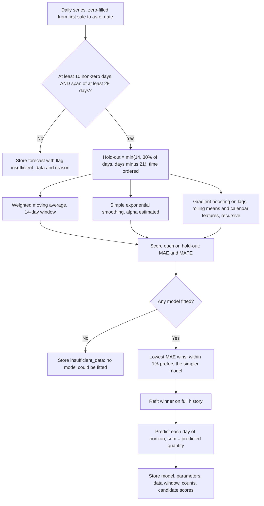
```mermaid
flowchart TB
    S["Daily series, zero-filled from first sale to as-of date"] --> G{"At least 10 non-zero days AND span of at least 28 days?"}
    G -- "No" --> X["Store forecast with flag insufficient_data and reason"]
    G -- "Yes" --> H["Hold-out = min(14, 30% of days, days minus 21), time ordered"]
    H --> C1["Weighted moving average, 14-day window"]
    H --> C2["Simple exponential smoothing, alpha estimated"]
    H --> C3["Gradient boosting on lags, rolling means and calendar features, recursive"]
    C1 --> E["Score each on hold-out: MAE and MAPE"]
    C2 --> E
    C3 --> E
    E --> F{"Any model fitted?"}
    F -- "No" --> X2["Store insufficient_data: no model could be fitted"]
    F -- "Yes" --> W["Lowest MAE wins; within 1% prefers the simpler model"]
    W --> R["Refit winner on full history"]
    R --> P["Predict each day of horizon; sum = predicted quantity"]
    P --> ST["Store model, parameters, data window, counts, candidate scores"]
```

*Note.* Author's design from forecasting.py.

#### Recommendation Flow

Figure 3.19 is the activity flowchart of the recommendation run. The decisive checks are whether the product has a sufficient forecast, whether it is short after the safety margin, and whether it has a known unit cost. Products failing the first or third check are counted in the run, and products that are not short are left out without being counted. The remaining candidates are scored and sorted, and the total required cost is compared with the budget to set the budget-constrained flag. The allocation step then gives each line its full need if the flag is false, or as much as the remaining budget allows if it is true.

**Figure 3.19**
*Activity Flowchart of the Recommendation Run*

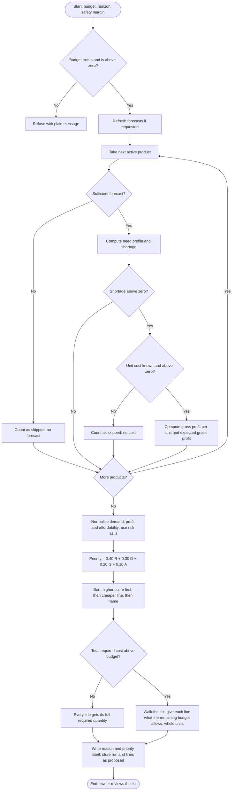
```mermaid
flowchart TB
    A(["Start: budget, horizon, safety margin"]) --> B{"Budget exists and is above zero?"}
    B -- "No" --> Z1["Refuse with plain message"]
    B -- "Yes" --> C["Refresh forecasts if requested"]
    C --> D["Take next active product"]
    D --> E{"Sufficient forecast?"}
    E -- "No" --> E1["Count as skipped: no forecast"] --> N
    E -- "Yes" --> F["Compute need profile and shortage"]
    F --> G{"Shortage above zero?"}
    G -- "No" --> N
    G -- "Yes" --> H{"Unit cost known and above zero?"}
    H -- "No" --> H1["Count as skipped: no cost"] --> N
    H -- "Yes" --> I["Compute gross profit per unit and expected gross profit"]
    I --> N{"More products?"}
    N -- "Yes" --> D
    N -- "No" --> J["Normalise demand, profit and affordability; use risk as is"]
    J --> K["Priority = 0.40 R + 0.30 D + 0.20 G + 0.10 A"]
    K --> L["Sort: higher score first, then cheaper line, then name"]
    L --> M{"Total required cost above budget?"}
    M -- "No" --> O["Every line gets its full required quantity"]
    M -- "Yes" --> P["Walk the list: give each line what the remaining budget allows, whole units"]
    O --> Q["Write reason and priority label; store run and lines as proposed"]
    P --> Q
    Q --> R(["End: owner reviews the list"])
```

*Note.* Author's design from `generate_recommendation_run`.

#### Priority Score Calculation

The priority score combines four factors on a common zero-to-one scale. Stockout risk is the shortage divided by the projected need, capped at one, and it is used as it is, without rescaling, because the ratio already has a direct meaning. Forecast demand, expected gross profit and affordability are min-max scaled across the candidates of the run, and if all candidates have equal values each is given one so that none is penalised. Affordability is first computed as one divided by one plus the required cost of covering the shortage, so a cheaper line is more affordable. The weights 0.40, 0.30, 0.20 and 0.10 are read from the settings and are saved with every run.

Figure 3.20 shows the calculation, and the same step also produces the short label. If risk is at least 0.8 the label is "Urgent: stockout risk". Otherwise the label names the factor with the largest weighted contribution, and if the second largest contribution is at least 60% of the largest, both names are joined. The velocity score and cost-efficiency score are still computed and stored for backward compatibility, and they no longer influence the priority. Because the label is only a summary, the stored score components remain the full record of why a line was ranked where it was.

**Figure 3.20**
*Priority Score Calculation*

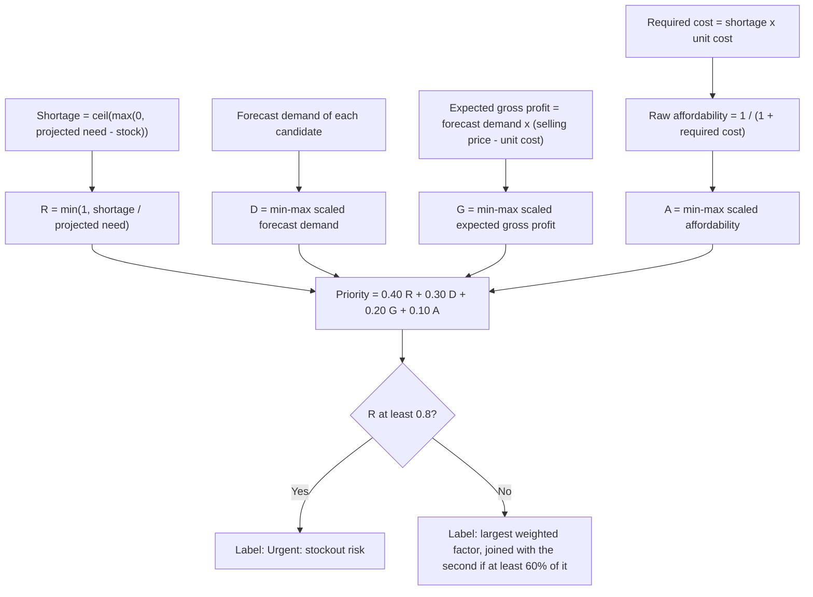
```mermaid
flowchart TB
    S1["Shortage = ceil(max(0, projected need - stock))"] --> R["R = min(1, shortage / projected need)"]
    F1["Forecast demand of each candidate"] --> D["D = min-max scaled forecast demand"]
    GP["Expected gross profit = forecast demand x (selling price - unit cost)"] --> G["G = min-max scaled expected gross profit"]
    RC["Required cost = shortage x unit cost"] --> AF["Raw affordability = 1 / (1 + required cost)"] --> A["A = min-max scaled affordability"]
    R --> SUM["Priority = 0.40 R + 0.30 D + 0.20 G + 0.10 A"]
    D --> SUM
    G --> SUM
    A --> SUM
    SUM --> LAB{"R at least 0.8?"}
    LAB -- "Yes" --> L1["Label: Urgent: stockout risk"]
    LAB -- "No" --> L2["Label: largest weighted factor, joined with the second if at least 60% of it"]
```

*Note.* Author's design from `generate_recommendation_run` and `_priority_label`.

The need profile that feeds the score is calculated from four lines. The daily rate is the forecast demand divided by the horizon. Lead-time demand is the daily rate multiplied by the product's reorder lead time in days, or zero when the lead time is unknown. Safety stock is the safety margin multiplied by the sum of the forecast demand and the lead-time demand. The projected need is the sum of forecast demand, lead-time demand and safety stock, so the code includes lead-time cover, which is more than the draft formula that only added safety stock to forecast demand.

#### Worked Budget Allocation Example

The worked example uses six invented products so that every number can be checked by hand. They are illustrative and are not taken from any shop. The settings are a 14-day horizon and a 20% safety margin, and the weights are the defaults. Table 3.14 gives the inputs and the need profile, Table 3.15 gives the scores, and Table 3.16 and Table 3.17 show the allocation under two budgets. The calculation follows the code step by step, including the rounding up of the shortage to whole units. All amounts are in Kenya shillings.

**Table 3.14**
*Worked Example: Inputs and Need Profile (Horizon 14 Days, Safety Margin 20%)*

| Product | Forecast | Lead time (days) | Stock | Cost | Price | Daily rate | Lead-time demand | Safety stock | Projected need | Shortage |
|---|---|---|---|---|---|---|---|---|---|---|
| Maize flour 2 kg | 120 | 2 | 30 | 120 | 140 | 8.57 | 17.14 | 27.43 | 164.57 | 135 |
| Cooking oil 1 L | 56 | 3 | 10 | 260 | 300 | 4.00 | 12.00 | 13.60 | 81.60 | 72 |
| Sugar 1 kg | 84 | 2 | 20 | 150 | 175 | 6.00 | 12.00 | 19.20 | 115.20 | 96 |
| Tea leaves 250 g | 28 | 1 | 5 | 90 | 120 | 2.00 | 2.00 | 6.00 | 36.00 | 31 |
| Bar soap | 42 | 2 | 10 | 45 | 60 | 3.00 | 6.00 | 9.60 | 57.60 | 48 |
| Rice 1 kg (stock fine) | 30 | 2 | 60 | 140 | 165 | 2.14 | 4.29 | 6.86 | 41.14 | 0 |

*Note.* Illustrative data. Daily rate = forecast / 14; lead-time demand = rate x lead time; safety stock = 0.20 x (forecast + lead-time demand); shortage = ceiling of (projected need - stock). Rice has a zero shortage and is therefore not a candidate.

The first product shows the method. Maize flour has a forecast of 120 units, so its daily rate is 120 / 14 = 8.57. With a 2-day lead time the lead-time demand is 17.14, and the safety stock is 0.20 x (120 + 17.14) = 27.43. The projected need is 120 + 17.14 + 27.43 = 164.57, and with 30 units on the shelf the shortage is 134.57, which rounds up to 135 units. Its stockout risk is 135 / 164.57 = 0.82, which is at least 0.8, so its short label is "Urgent: stockout risk"; in this example all five candidates have a risk between 0.82 and 0.88, so all carry that label. Rice has 60 units against a need of 41.14, so it needs nothing and is left out of the run.

**Table 3.15**
*Worked Example: Factors, Priority Score and Rank*

| Rank | Product | Required cost | Gross profit per unit | Expected gross profit | R | D | G | A | Priority score |
|---|---|---|---|---|---|---|---|---|---|
| 1 | Maize flour 2 kg | 16,200 | 20 | 2,400 | 0.820 | 1.000 | 1.000 | 0.020 | 0.8302 |
| 2 | Sugar 1 kg | 14,400 | 25 | 2,100 | 0.833 | 0.609 | 0.831 | 0.039 | 0.6860 |
| 3 | Cooking oil 1 L | 18,720 | 40 | 2,240 | 0.882 | 0.304 | 0.910 | 0.000 | 0.6262 |
| 4 | Bar soap | 2,160 | 15 | 630 | 0.833 | 0.152 | 0.000 | 1.000 | 0.4790 |
| 5 | Tea leaves 250 g | 2,790 | 30 | 840 | 0.861 | 0.000 | 0.119 | 0.745 | 0.4427 |

*Note.* R = stockout risk used as is; D, G and A are min-max scaled across the five candidates. Priority = 0.40 R + 0.30 D + 0.20 G + 0.10 A. Total required cost of all candidates = KES 54,270.

For the top product the score is 0.40 x 0.820 + 0.30 x 1.000 + 0.20 x 1.000 + 0.10 x 0.020 = 0.8302. Maize flour has the largest forecast and the largest expected gross profit, so both scaled values are 1.000, and its affordability is near zero because covering its shortage is expensive. The bar soap and tea lines are cheap and therefore score high on affordability, but their low demand and profit keep them low in the ranking. Because the total required cost of KES 54,270 is larger than the smaller budget, the budget is constrained and the walk down the list matters. Under the large budget every line is simply fully funded, as Table 3.17 shows.

**Table 3.16**
*Worked Example: Allocation with a Budget of KES 20,000 (Constrained)*

| Rank | Product | Needed | Unit cost | Remaining before | Bought | Cost | Remaining after | Expected profit on units bought |
|---|---|---|---|---|---|---|---|---|
| 1 | Maize flour 2 kg | 135 | 120 | 20,000 | 135 | 16,200 | 3,800 | 2,700 |
| 2 | Sugar 1 kg | 96 | 150 | 3,800 | 25 | 3,750 | 50 | 625 |
| 3 | Cooking oil 1 L | 72 | 260 | 50 | 0 | 0 | 50 | 0 |
| 4 | Bar soap | 48 | 45 | 50 | 1 | 45 | 5 | 15 |
| 5 | Tea leaves 250 g | 31 | 90 | 5 | 0 | 0 | 5 | 0 |

*Note.* Budget constrained: yes. Total recommended cost = KES 19,995; total expected gross profit of the basket = KES 3,340. Profit is computed on units actually allocated (gross profit per unit x recommended quantity), as in the code.

**Table 3.17**
*Worked Example: Allocation with a Budget of KES 60,000 (Not Constrained)*

| Rank | Product | Needed | Unit cost | Remaining before | Bought | Cost | Remaining after | Expected profit on units bought |
|---|---|---|---|---|---|---|---|---|
| 1 | Maize flour 2 kg | 135 | 120 | 60,000 | 135 | 16,200 | 43,800 | 2,700 |
| 2 | Sugar 1 kg | 96 | 150 | 43,800 | 96 | 14,400 | 29,400 | 2,400 |
| 3 | Cooking oil 1 L | 72 | 260 | 29,400 | 72 | 18,720 | 10,680 | 2,880 |
| 4 | Bar soap | 48 | 45 | 10,680 | 48 | 2,160 | 8,520 | 720 |
| 5 | Tea leaves 250 g | 31 | 90 | 8,520 | 31 | 2,790 | 5,730 | 930 |

*Note.* Budget constrained: no. Total recommended cost = KES 54,270; total expected gross profit of the basket = KES 9,630. Profit is computed on units actually allocated (gross profit per unit x recommended quantity), as in the code.

Under the KES 20,000 budget, the walk shows the 'keep walking' rule. Maize flour takes KES 16,200 for its full 135 units and leaves KES 3,800. Sugar then gets only the 25 units that KES 3,800 can buy at KES 150, which is a partial fill costing KES 3,750, and KES 50 remains. Cooking oil costs KES 260 a unit and cannot be afforded, so it gets zero, but the walk continues, and bar soap at KES 45 is still affordable for one unit, leaving KES 5. Tea leaves at KES 90 cannot be afforded, so the allocation ends with 161 units bought for KES 19,995.

Figure 3.21 traces the same budget walk as a flowchart. Each step shows the remaining budget before the line, the units that the remaining budget can buy, and the quantity actually allocated, which is the smaller of that figure and the need. The first line takes most of the budget because it ranks highest. The second line is only partly funded because the remaining money buys fewer units than needed. A line that cannot be afforded at all is passed over, and the walk continues to the next line. The walk ends when the list is finished, and any small amount left over stays unspent.

**Figure 3.21**
*Worked Budget Allocation Walk for a Budget of KES 20,000*

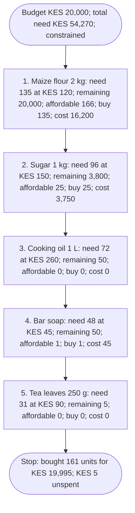
```mermaid
flowchart TB
    B0(["Budget KES 20,000; total need KES 54,270; constrained"]) --> L1

    L1["1. Maize flour 2 kg: need 135 at KES 120; remaining 20,000; affordable 166; buy 135; cost 16,200"]
    L2["2. Sugar 1 kg: need 96 at KES 150; remaining 3,800; affordable 25; buy 25; cost 3,750"]
    L3["3. Cooking oil 1 L: need 72 at KES 260; remaining 50; affordable 0; buy 0; cost 0"]
    L4["4. Bar soap: need 48 at KES 45; remaining 50; affordable 1; buy 1; cost 45"]
    L5["5. Tea leaves 250 g: need 31 at KES 90; remaining 5; affordable 0; buy 0; cost 0"]
    L1 --> L2
    L2 --> L3
    L3 --> L4
    L4 --> L5
    L5 --> END(["Stop: bought 161 units for KES 19,995; KES 5 unspent"])
```

*Note.* Author's illustrative example using the allocation rule of recommendation.py. The flowchart nodes list the rank, product, need, remaining budget, units affordable, units bought and cost.


#### Owner Decision State Chart

Each recommendation line starts as proposed and changes state only when the owner decides. The code has four stored statuses, which the screens call pending, accepted, changed and skipped: proposed, accepted, modified and rejected. Accepting copies the recommended quantity into the operator quantity. Modifying requires a quantity that is not negative, and rejecting sets the operator quantity to zero. The decision time is stored each time. The function does not forbid a later decision on a line that is already decided, so the owner can change their mind, and the state chart in Figure 3.22 shows these transitions.

**Figure 3.22**
*State Chart of a Recommendation Line*

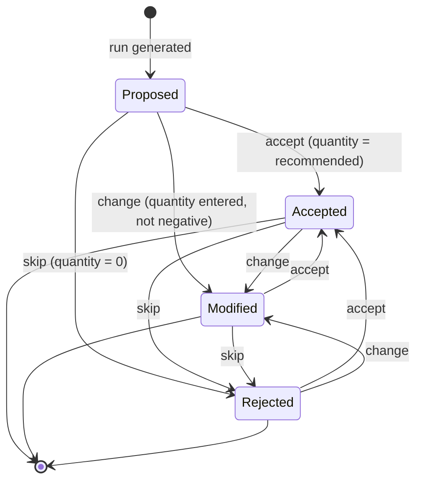
```mermaid
stateDiagram-v2
    [*] --> Proposed : run generated
    Proposed --> Accepted : accept (quantity = recommended)
    Proposed --> Modified : change (quantity entered, not negative)
    Proposed --> Rejected : skip (quantity = 0)
    Accepted --> Modified : change
    Accepted --> Rejected : skip
    Modified --> Accepted : accept
    Modified --> Rejected : skip
    Rejected --> Accepted : accept
    Rejected --> Modified : change
    Accepted --> [*]
    Modified --> [*]
    Rejected --> [*]
```

*Note.* Screen terms: Proposed = pending, Modified = changed, Rejected = skipped. Author's design from `apply_decision`.

An important limit applies here. The decision records the owner's intention, but it does not create a purchase or a stock movement. Stock changes only when the owner later records a delivery. This keeps the system advisory and prevents the plan from being mistaken for stock that has arrived. The owner therefore still has to record the delivery as a separate action.

#### Pseudocode of the Core Rules

The pseudocode in Figure 3.23 summarises the recommendation rule in a form that can be read without Python. It follows the code in order and names no feature that the code lacks. It uses the same names as the narrative sections so that the reader can match each line to the earlier explanation. Rounding is shown explicitly because shortage is rounded up and affordable units are rounded down. The budget loop is shown in two forms, one for the unconstrained case and one for the constrained case. The pseudocode is a summary and the Python in recommendation.py remains the authoritative description.

**Figure 3.23**
*Pseudocode for Need, Priority and Allocation*

```text
FOR each active product with a sufficient forecast:
    rate      = forecast / horizon
    leadDem   = rate * leadTimeDays            (0 if unknown)
    safety    = margin * (forecast + leadDem)
    need      = forecast + leadDem + safety
    shortage  = CEILING(MAX(0, need - stock))
    IF shortage > 0 AND unitCost > 0 THEN
        gpu = sellingPrice - unitCost
        egp = forecast * gpu
        add to candidates
FOR each candidate:
    R = MIN(1, shortage / need)
    D, G, A = minmax(forecast), minmax(egp), minmax(1 / (1 + shortage * unitCost))
    score = 0.40*R + 0.30*D + 0.20*G + 0.10*A
SORT candidates by score DESC, then required cost ASC, then name
total = SUM(shortage * unitCost)
constrained = total > budget
remaining = budget
FOR each candidate in order:
    IF NOT constrained THEN qty = shortage
    ELSE qty = MAX(0, MIN(shortage, FLOOR(remaining / unitCost)))
    remaining = remaining - qty * unitCost
    save line with qty, reason, label, status = proposed
```

*Note.* Author's summary of recommendation.py.

### 3.8.3 Design for Non-Functional Requirements

#### Security

Passwords are checked against a policy before hashing: at least 8 characters, and at most 72 bytes because bcrypt silently ignores anything beyond that limit. The code rejects longer input so that two different long passwords cannot be accepted as equal. Hashes are produced with bcrypt and a fresh salt, and verification catches malformed hashes and fails closed. Tokens are signed with HS256 using a secret from the settings and expire after 12 hours. The default secret in config.py is a development value and the comment states that it must be supplied by the environment in any real deployment, which is a deployment requirement and not a feature.

The cross-origin setting defaults to a wildcard, and the code comments justify this because the system uses bearer tokens and not cookies. Owner-only access to budgets and recommendations is intended and the role is carried in the token, yet the check itself sits in the router layer that was not supplied. <mark style="background:yellow">[INSERT: confirm in the routers which routes require the owner role, and confirm the SQLite pragmas for foreign keys and write-ahead logging, which are named in the project draft but are not visible in the supplied files]</mark> This choice is reasonable for local development. A shop that exposes the system on a network should restrict the allowed origins through the setting named cors_origins. The default secret key should also be replaced by a long random value supplied through the environment. These two changes are deployment tasks and are listed here so that they are not forgotten.

#### Error and Exception Handling

The services raise a single business-rule exception whose message is written in plain language, and the routers are said in the code comments to translate it into an HTTP 400 response that shows the message. Examples are that there is not enough stock, that the quantity must be more than zero, that a product was not found, or that the budget must be more than zero. Multi-step writes use savepoints so that a failure leaves nothing half-written. Inside the forecasting engine a failing candidate is recorded with its error text and score of infinity and does not stop the others, and a total model failure returns an insufficient-data outcome with a reason. These behaviours will be tested in Chapter 4 through deliberately invalid inputs.

Some limits are visible in the code. In a sale, each line is checked against the stock read before the sale, so two lines for the same product are each compared to the full stock and not to the remaining stock. Stock is read before the savepoint and the code takes no explicit lock, which is acceptable for one shop on SQLite but would need care with many simultaneous users. The adjustment function requires a note argument but does not itself reject an empty one, so the "no adjustment without a reason" rule must be enforced by the schema or router. These points are listed so that the tests in Chapter 4 can probe them.

#### Efficiency and Appeal

Efficiency is supported by batch queries. The stock for all products is obtained in one grouped query, all sales series for a run are read in one query, and the latest unit costs are read in one ordered query and reduced in Python. The forecasting engine fixes the random seed of the gradient boosting model at 42, so the same data always give the same forecast. The interface appeal is addressed by plain labels, summary cards, two charts on the home page and short explanations. The interface was reported to have a known display fault on the home chart, where the vertical axis shows the label "2k" twice because of tick formatting, and this is recorded as a defect to fix and not as a design feature.


## 3.9 Physical Design

### 3.9.1 Database Design

#### Choice of DBMS

The default database is SQLite, and its address is a single setting in config.py that points to a file named dukasmart.db beside the backend folder. SQLite was chosen because it needs no server, no installation and no licence, so a small shop can run the whole system on one computer. All access goes through SQLAlchemy, and the models avoid database-specific features, for example by storing enumerations as text and by keeping JSON content in text columns so that the same code runs on SQLite and PostgreSQL. This design leaves a clear migration path to PostgreSQL if a shop grows or if several users must write at the same time. The main limit of SQLite is that it allows one writer at a time, which is acceptable for the single-shop scope of this project.

The database stores thirteen tables, which are listed in the schema tables below. Twelve of them are entity tables, including the recommendation run table that groups the lines produced by one request, and one is the association table that links products to suppliers. The central design rule is stated in the models file: there is no mutable stock column on the product table, and current stock is the sum of the signed quantities in the inventory movement table. Each movement also stores a snapshot of the resulting stock for reading convenience, but that column is never treated as the truth. The entity-relationship diagram in Figure 3.24 shows how the tables relate.

**Figure 3.24**
*Entity-Relationship Diagram Derived from the Models*

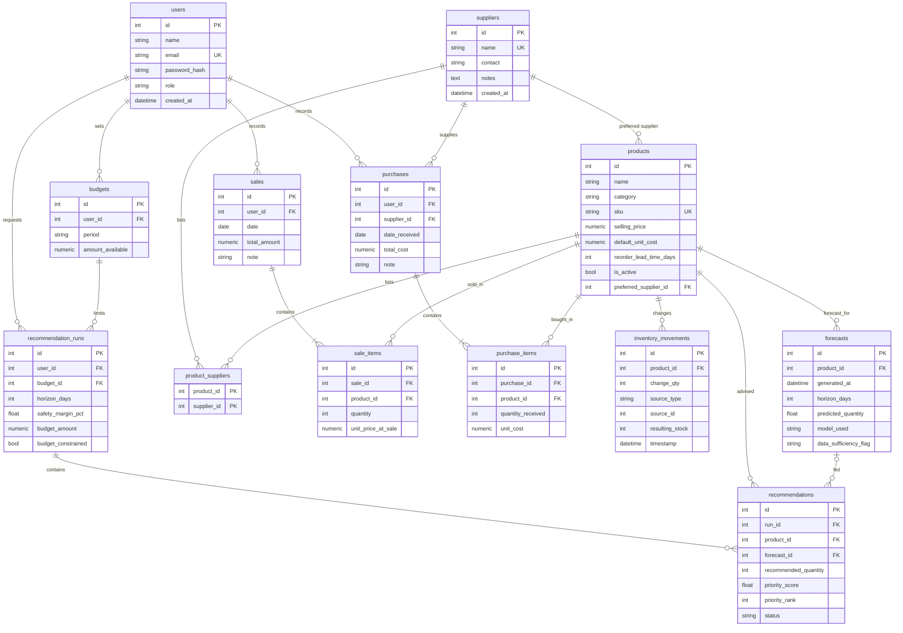
```mermaid
erDiagram
    users ||--o{ sales : records
    users ||--o{ purchases : records
    users ||--o{ budgets : sets
    users ||--o{ recommendation_runs : requests
    suppliers ||--o{ purchases : supplies
    suppliers ||--o{ products : "preferred supplier"
    suppliers ||--o{ product_suppliers : lists
    products ||--o{ product_suppliers : lists
    sales ||--|{ sale_items : contains
    purchases ||--|{ purchase_items : contains
    products ||--o{ sale_items : sold_in
    products ||--o{ purchase_items : bought_in
    products ||--o{ inventory_movements : changes
    products ||--o{ forecasts : forecast_for
    budgets ||--o{ recommendation_runs : limits
    recommendation_runs ||--o{ recommendations : contains
    products ||--o{ recommendations : advised
    forecasts |o--o{ recommendations : fed

    users {
        int id PK
        string name
        string email UK
        string password_hash
        string role
        datetime created_at
    }
    suppliers {
        int id PK
        string name UK
        string contact
        text notes
        datetime created_at
    }
    products {
        int id PK
        string name
        string category
        string sku UK
        numeric selling_price
        numeric default_unit_cost
        int reorder_lead_time_days
        bool is_active
        int preferred_supplier_id FK
    }
    product_suppliers {
        int product_id PK
        int supplier_id PK
    }
    sales {
        int id PK
        int user_id FK
        date date
        numeric total_amount
        string note
    }
    sale_items {
        int id PK
        int sale_id FK
        int product_id FK
        int quantity
        numeric unit_price_at_sale
    }
    purchases {
        int id PK
        int user_id FK
        int supplier_id FK
        date date_received
        numeric total_cost
        string note
    }
    purchase_items {
        int id PK
        int purchase_id FK
        int product_id FK
        int quantity_received
        numeric unit_cost
    }
    inventory_movements {
        int id PK
        int product_id FK
        int change_qty
        string source_type
        int source_id
        int resulting_stock
        datetime timestamp
    }
    forecasts {
        int id PK
        int product_id FK
        datetime generated_at
        int horizon_days
        float predicted_quantity
        string model_used
        string data_sufficiency_flag
    }
    budgets {
        int id PK
        int user_id FK
        string period
        numeric amount_available
    }
    recommendation_runs {
        int id PK
        int user_id FK
        int budget_id FK
        int horizon_days
        float safety_margin_pct
        numeric budget_amount
        bool budget_constrained
    }
    recommendations {
        int id PK
        int run_id FK
        int product_id FK
        int forecast_id FK
        int recommended_quantity
        float priority_score
        int priority_rank
        string status
    }
```

*Note.* Derived from models.py. Only key columns are drawn here; every column is given in the schema tables. Movement and item rows reference sales or purchases through `source_id` without a database foreign key.

#### Schema Tables

The schema tables below give every column, its type, whether it is required, its default and its constraints, exactly as declared in models.py. Money columns are NUMERIC(12,2) and are returned to Python as floating-point numbers because the declaration sets decimal handling off. Text sizes are the declared VARCHAR lengths. Enumerations are stored as short text values, and the helper in the models file states that they are plain VARCHAR with a check constraint. In SQLAlchemy 2.0 that check is created only when the constraint option is switched on, which the helper does not do, so the allowed values may be enforced by the application and not by the database; the actual table definition in dukasmart.db should be inspected to confirm this.


**Table 3.18**
*Schema of the users Table*

| Column | Type | Null | Default | Key / constraint / index |
|---|---|---|---|---|
| id | INTEGER | No | auto | Primary key |
| name | VARCHAR(120) | No | none |  |
| email | VARCHAR(255) | No | none | Unique; indexed |
| password_hash | VARCHAR(255) | No | none | Stores the bcrypt hash only |
| role | VARCHAR (owner, staff) | No | staff | Enumeration user_role |
| created_at | DATETIME | No | current UTC time |  |

*Note.* Source: User in models.py.


**Table 3.19**
*Schema of the suppliers Table*

| Column | Type | Null | Default | Key / constraint / index |
|---|---|---|---|---|
| id | INTEGER | No | auto | Primary key |
| name | VARCHAR(160) | No | none | Unique |
| contact | VARCHAR(160) | Yes | none |  |
| notes | TEXT | Yes | none |  |
| created_at | DATETIME | No | current UTC time |  |

*Note.* Source: Supplier in models.py.


**Table 3.20**
*Schema of the products Table*

| Column | Type | Null | Default | Key / constraint / index |
|---|---|---|---|---|
| id | INTEGER | No | auto | Primary key |
| name | VARCHAR(160) | No | none | Indexed |
| category | VARCHAR(80) | Yes | none | Indexed |
| sku | VARCHAR(64) | No | none | Unique; indexed |
| selling_price | NUMERIC(12,2) | No | none | Check: selling_price >= 0 |
| default_unit_cost | NUMERIC(12,2) | No | 0 | Check: default_unit_cost >= 0 |
| reorder_lead_time_days | INTEGER | Yes | none | Unknown treated as 0 in calculations |
| is_active | BOOLEAN | No | true | Only active products are forecast and recommended |
| created_at | DATETIME | No | current UTC time |  |
| preferred_supplier_id | INTEGER | Yes | none | Foreign key to suppliers.id, ON DELETE SET NULL |

*Note.* Source: Product in models.py.


**Table 3.21**
*Schema of the product_suppliers Table*

| Column | Type | Null | Default | Key / constraint / index |
|---|---|---|---|---|
| product_id | INTEGER | No | none | Primary key part; foreign key to products.id, ON DELETE CASCADE |
| supplier_id | INTEGER | No | none | Primary key part; foreign key to suppliers.id, ON DELETE CASCADE |

*Note.* Source: association table in models.py. A product may have several suppliers.


**Table 3.22**
*Schema of the sales Table*

| Column | Type | Null | Default | Key / constraint / index |
|---|---|---|---|---|
| id | INTEGER | No | auto | Primary key |
| user_id | INTEGER | No | none | Foreign key to users.id |
| date | DATE | No | none | Indexed |
| total_amount | NUMERIC(12,2) | No | 0 | Set by the service after the items are added |
| note | VARCHAR(255) | Yes | none |  |
| created_at | DATETIME | No | current UTC time |  |

*Note.* Source: Sale in models.py.


**Table 3.23**
*Schema of the sale_items Table*

| Column | Type | Null | Default | Key / constraint / index |
|---|---|---|---|---|
| id | INTEGER | No | auto | Primary key |
| sale_id | INTEGER | No | none | Foreign key to sales.id, ON DELETE CASCADE |
| product_id | INTEGER | No | none | Foreign key to products.id; index ix_sale_items_product |
| quantity | INTEGER | No | none | Check: quantity > 0 |
| unit_price_at_sale | NUMERIC(12,2) | No | none | Check: >= 0; defaults to the selling price when not given |

*Note.* Source: SaleItem in models.py. Lines are deleted with their sale.


**Table 3.24**
*Schema of the purchases Table*

| Column | Type | Null | Default | Key / constraint / index |
|---|---|---|---|---|
| id | INTEGER | No | auto | Primary key |
| user_id | INTEGER | No | none | Foreign key to users.id |
| supplier_id | INTEGER | No | none | Foreign key to suppliers.id |
| date_received | DATE | No | none | Indexed |
| total_cost | NUMERIC(12,2) | No | 0 | Set by the service |
| note | VARCHAR(255) | Yes | none |  |
| created_at | DATETIME | No | current UTC time |  |

*Note.* Source: Purchase in models.py. This table stores deliveries.


**Table 3.25**
*Schema of the purchase_items Table*

| Column | Type | Null | Default | Key / constraint / index |
|---|---|---|---|---|
| id | INTEGER | No | auto | Primary key |
| purchase_id | INTEGER | No | none | Foreign key to purchases.id, ON DELETE CASCADE |
| product_id | INTEGER | No | none | Foreign key to products.id; index ix_purchase_items_product |
| quantity_received | INTEGER | No | none | Check: quantity_received > 0 |
| unit_cost | NUMERIC(12,2) | No | none | Check: unit_cost >= 0 |

*Note.* Source: PurchaseItem in models.py.


**Table 3.26**
*Schema of the inventory_movements Table*

| Column | Type | Null | Default | Key / constraint / index |
|---|---|---|---|---|
| id | INTEGER | No | auto | Primary key |
| product_id | INTEGER | No | none | Foreign key to products.id, ON DELETE CASCADE |
| change_qty | INTEGER | No | none | Check: change_qty <> 0; negative for sales |
| source_type | VARCHAR (sale, purchase, adjustment) | No | none | Enumeration movement_source |
| source_id | INTEGER | Yes | none | Id of the sale or purchase; empty for adjustments; no database foreign key |
| resulting_stock | INTEGER | No | none | Snapshot after the change; convenience only |
| note | VARCHAR(255) | Yes | none | Reason for adjustments |
| timestamp | DATETIME | No | current UTC time | Indexed; composite index ix_movements_product_time (product_id, timestamp) |

*Note.* Source: InventoryMovement in models.py. Append-only; current stock is the sum of change_qty per product.


**Table 3.27**
*Schema of the forecasts Table*

| Column | Type | Null | Default | Key / constraint / index |
|---|---|---|---|---|
| id | INTEGER | No | auto | Primary key |
| product_id | INTEGER | No | none | Foreign key to products.id, ON DELETE CASCADE |
| generated_at | DATETIME | No | current UTC time | Composite index ix_forecasts_product_time (product_id, generated_at) |
| horizon_days | INTEGER | No | none |  |
| predicted_quantity | FLOAT | Yes | none | Empty when data are insufficient |
| model_used | VARCHAR(60) | Yes | none |  |
| model_params | TEXT | Yes | none | JSON text: parameters, hold-out, as-of date, daily predictions |
| error_metrics | TEXT | Yes | none | JSON text: MAE and MAPE |
| mae | FLOAT | Yes | none |  |
| mape | FLOAT | Yes | none |  |
| data_sufficiency_flag | VARCHAR (sufficient, insufficient_data) | No | none | Enumeration data_sufficiency |
| insufficiency_reason | VARCHAR(255) | Yes | none |  |
| bucket | VARCHAR(10) | No | daily |  |
| data_window_start | DATE | Yes | none |  |
| data_window_end | DATE | Yes | none |  |
| observations_used | INTEGER | Yes | none |  |
| nonzero_observations | INTEGER | Yes | none |  |
| candidate_scores | TEXT | Yes | none | JSON text: every model's score |

*Note.* Source: Forecast in models.py. A new row is added every time forecasts are generated, and the newest row per product and horizon is used.


**Table 3.28**
*Schema of the budgets Table*

| Column | Type | Null | Default | Key / constraint / index |
|---|---|---|---|---|
| id | INTEGER | No | auto | Primary key |
| user_id | INTEGER | No | none | Foreign key to users.id |
| period | VARCHAR(40) | No | none | Free text such as 2026-08 or Week 34 |
| amount_available | NUMERIC(12,2) | No | none | Check: amount_available >= 0 |
| created_at | DATETIME | No | current UTC time |  |

*Note.* Source: Budget in models.py.


**Table 3.29**
*Schema of the recommendation_runs Table*

| Column | Type | Null | Default | Key / constraint / index |
|---|---|---|---|---|
| id | INTEGER | No | auto | Primary key |
| user_id | INTEGER | No | none | Foreign key to users.id |
| budget_id | INTEGER | No | none | Foreign key to budgets.id |
| generated_at | DATETIME | No | current UTC time |  |
| horizon_days | INTEGER | No | none |  |
| safety_margin_pct | FLOAT | No | none | Fraction, for example 0.20 |
| budget_amount | NUMERIC(12,2) | No | none | Copy of the budget used |
| total_required_cost | NUMERIC(12,2) | No | 0 |  |
| total_recommended_cost | NUMERIC(12,2) | No | 0 |  |
| budget_constrained | BOOLEAN | No | false | True when the total need is above the budget |
| weights_used | TEXT | Yes | none | JSON text of the four weights |
| products_considered | INTEGER | No | 0 |  |
| products_skipped_no_forecast | INTEGER | No | 0 |  |
| products_skipped_no_cost | INTEGER | No | 0 |  |

*Note.* Source: RecommendationRun in models.py. A comment in the file records that the total expected gross profit is not stored here.


**Table 3.30**
*Schema of the recommendations Table*

| Column | Type | Null | Default | Key / constraint / index |
|---|---|---|---|---|
| id | INTEGER | No | auto | Primary key |
| run_id | INTEGER | No | none | Foreign key to recommendation_runs.id, ON DELETE CASCADE; unique with product_id |
| generated_at | DATETIME | No | current UTC time |  |
| product_id | INTEGER | No | none | Foreign key to products.id; unique with run_id |
| forecast_id | INTEGER | Yes | none | Foreign key to forecasts.id |
| current_stock | INTEGER | No | none | Stock when the run was made |
| forecast_demand | FLOAT | No | none |  |
| safety_stock | FLOAT | No | 0 |  |
| lead_time_demand | FLOAT | No | 0 |  |
| estimated_shortage | INTEGER | No | none |  |
| unit_cost | NUMERIC(12,2) | No | none |  |
| required_quantity | INTEGER | No | none |  |
| required_cost | NUMERIC(12,2) | No | none |  |
| recommended_quantity | INTEGER | No | none | After budget allocation |
| recommended_cost | NUMERIC(12,2) | No | none |  |
| stockout_risk_score | FLOAT | No | 0 | R in the priority score |
| demand_velocity_score | FLOAT | No | 0 | Stored; not in the priority score |
| cost_efficiency_score | FLOAT | No | 0 | Stored; not in the priority score |
| priority_score | FLOAT | No | 0 |  |
| priority_rank | INTEGER | No | none |  |
| reason | TEXT | Yes | none | Full paragraph explanation |
| gross_profit_per_unit | FLOAT | Yes | none | Selling price minus unit cost |
| expected_gross_profit | FLOAT | Yes | none | Forecast demand times gross profit per unit |
| priority_reason | TEXT | Yes | none | Short label for the table |
| status | VARCHAR (proposed, accepted, modified, rejected) | No | proposed | Enumeration recommendation_status |
| operator_quantity | INTEGER | Yes | none | Owner's quantity |
| decided_at | DATETIME | Yes | none |  |

*Note.* Source: Recommendation in models.py. The profitability columns and the short priority label were added later according to comments in the file.


#### Integrity, Indexing, Security and Query Optimisation

Integrity is protected at several levels. Foreign keys tie every item to its header and every header to its user, and cascade rules remove item lines with their sale or delivery and movements with their product. Check constraints reject negative prices and costs, zero or negative quantities, zero-quantity movements and negative budgets. Unique keys protect the email address of a user, the name of a supplier, the SKU of a product and the pairing of a run with a product in the recommendation table. The services add the business checks that a database cannot express, such as the stock sufficiency test, and they raise plain-language errors for them.

Indexing follows the main queries. Sales are looked up by date, deliveries by the date received, and movements by product and time, so each has an index. Items are looked up by product through two named indexes, and forecasts by product and generation time through a composite index. Product name, category and SKU are indexed for search and lists. The dates and product columns indexed in this way are exactly the ones that the stock, series-building and costing queries filter on.

Security of the stored data rests on the password hash, the fact that no table stores a token, and the restriction of what can be altered. Movements are append-only in practice, since the services only add them and corrections are made by new adjustments. Forecasts and recommendations keep their inputs, so past advice stays explainable after the data change. The database file itself is not encrypted, and protecting the computer that holds it is the responsibility of the shop. Access control to the data is exercised through the application, not through the database.

Query optimisation avoids the pattern of one query per product. Stock for all listed products comes from a single grouped sum, and the series for all products in a run come from a single joined query that is then grouped in memory. The latest unit cost per product comes from one ordered query where later rows overwrite earlier ones. Recent forecasts are read in order and the newest per product is kept. These choices keep the number of queries constant as the product list grows, which matters for the run that touches every active product.

### 3.9.2 User Interface Design

#### Navigation and Principles

The interface is a single-page application with a persistent sidebar and a content area. The sidebar lists ten destinations, which are Home, Record a sale, Record delivery, Stock, What to buy, Sales outlook, Products, Suppliers, Sales & deliveries and Reports. The home page greets the user by name and shows four summary cards, namely sales of the last seven days with the change from the week before, products running low against the next 14 days, empty shelves, and products and suppliers tracked. It also shows a chart called Money coming in for daily sales over the last 30 days, a chart called Best sellers for units in the last seven days, and a Record a sale button. The design principles are plain words, one task per page, visible totals, and explanations beside every recommendation.

The home page in the wireframes follows the author's screenshot of 30 September 2026. The other pages are low-fidelity layout proposals whose fields follow the data the services require, and they should be compared with the final screens before submission. Wireframes are supplied as separate SVG files in the wireframes folder and are referenced in Table 3.31. Each wireframe uses the same sidebar so that the reader sees the navigation as the user does. The wireframes use boxes and plain labels only, because their purpose is to fix the layout and not the colour or style.

**Table 3.31**
*Wireframe Files*

| Page | File | Basis |
|---|---|---|
| Login | wireframes/01_login.svg | Sign-in inputs of the security module |
| Home | wireframes/02_home.svg | Author's screenshot, 30 September 2026 |
| Record a sale | wireframes/03_record_sale.svg | Fields of `record_sale` |
| Record delivery | wireframes/04_record_delivery.svg | Fields of `record_purchase` |
| Stock | wireframes/05_stock.svg | `current_stock_map`, `record_adjustment` |
| What to buy | wireframes/06_what_to_buy.svg | Run inputs and Recommendation columns |
| Sales outlook | wireframes/07_sales_outlook.svg | Forecast columns |
| Products | wireframes/08_products.svg | Product columns |
| Suppliers | wireframes/09_suppliers.svg | Supplier columns |
| Reports | wireframes/10_reports.svg | Dashboard and report needs |

*Note.* Prepared by the author. Pages not in the screenshot are proposals.

#### Input and Output Forms

The main input forms and the checks that apply to them are summarised in Table 3.32. Each form shows the plain error message from the service when a rule is broken. Output forms are the dashboard, the stock list, the sales outlook table, the recommendation table with its explanation panel, and the reports. The recommendation table shows the rank, product, quantity needed, quantity recommended, cost, the short priority label and the actions accept, change and skip, while the longer reason is shown on selection. The services repeat their own checks whatever the screen does, so that a rule cannot be bypassed.

**Table 3.32**
*Input Forms and Validation Rules*

| Form | Inputs | Rules applied by the code |
|---|---|---|
| Sign-in | Email, password | Password length 8 to 72 bytes when set; failed verification gives a failure |
| Record a sale | Date, note, lines of product, quantity, optional unit price | At least one line; quantity above zero; price not negative; not above stock unless overridden |
| Record delivery | Supplier, date received, note, lines of product, quantity, unit cost | At least one line; quantity above zero; cost not negative |
| Stock adjustment | Product, signed quantity, note | Quantity not zero; result not below zero unless overridden |
| Product | Name, category, SKU, selling price, default cost, lead time, supplier, opening stock | SKU unique; price and cost not negative; opening stock recorded as an adjustment |
| Supplier | Name, contact, notes | Name unique |
| Budget | Period label, amount | Amount not negative; a run needs an amount above zero |
| Recommendation request | Budget, horizon (7, 14 or 30 days), safety margin | Horizon from the allowed list; budget found |
| Decision | Accept, change quantity, or skip | Change needs a quantity that is not negative |

*Note.* Compiled from the services and models.

#### Wireframes


**Figure 3.25**
*Wireframe of the Login Page*

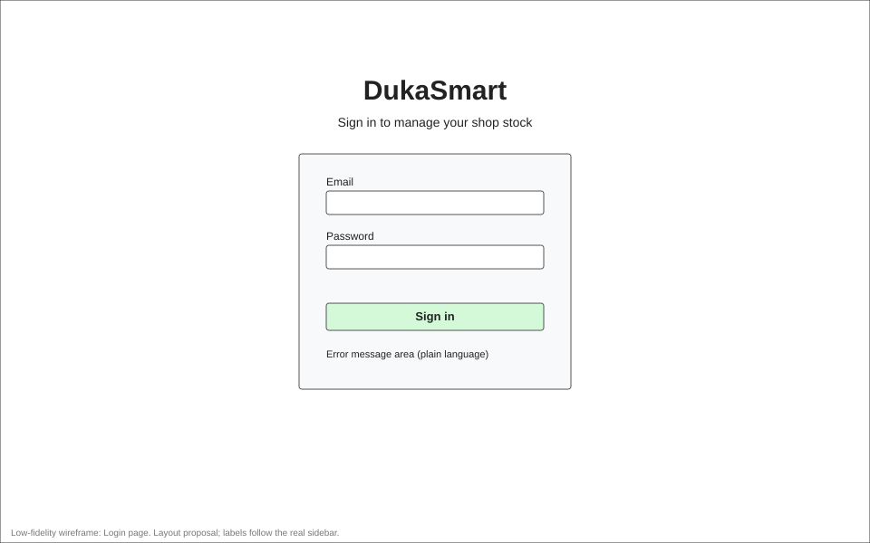

*Note.* Low-fidelity layout by the author. File: wireframes/01_login.svg.


**Figure 3.26**
*Wireframe of the Home Page*

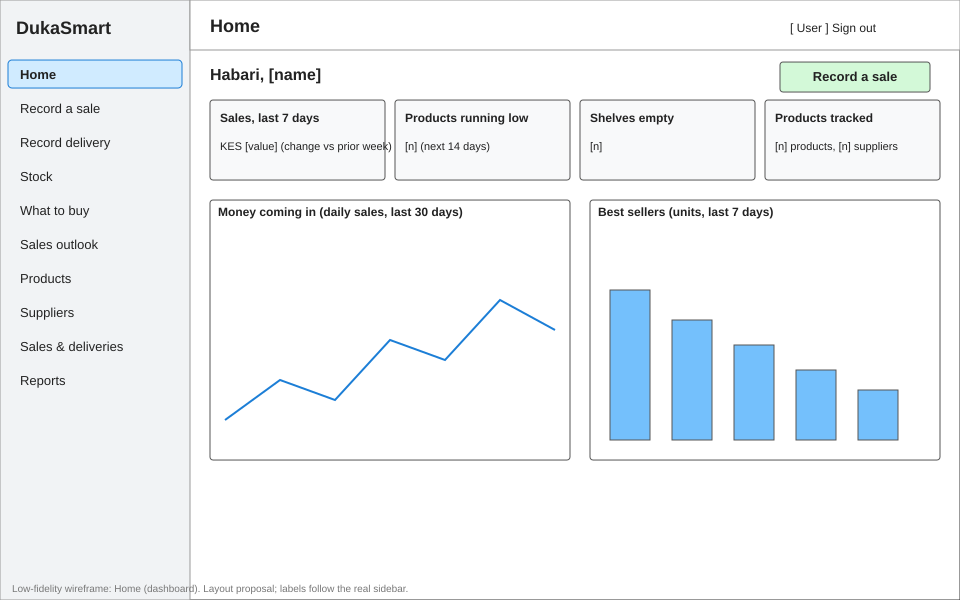

*Note.* Low-fidelity layout by the author. File: wireframes/02_home.svg.


**Figure 3.27**
*Wireframe of the Record a Sale Page*

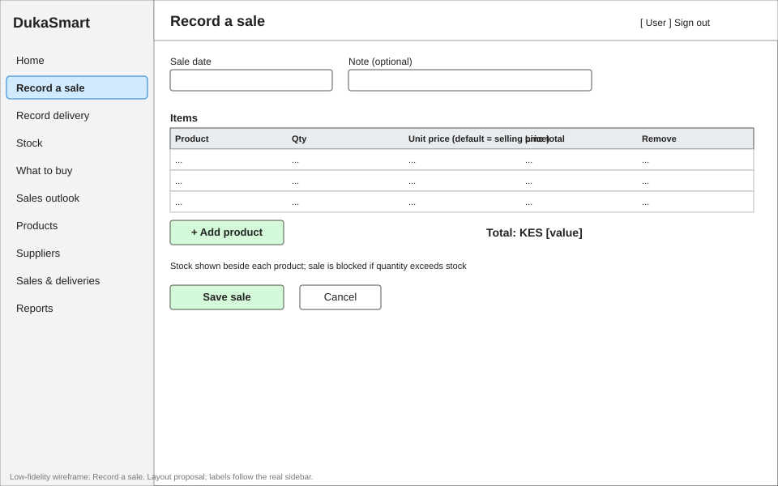

*Note.* Low-fidelity layout by the author. File: wireframes/03_record_sale.svg.


**Figure 3.28**
*Wireframe of the Record Delivery Page*

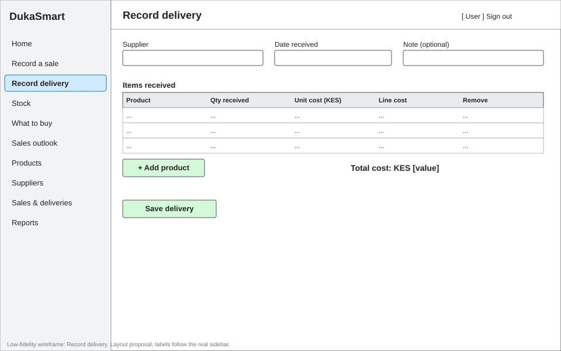

*Note.* Low-fidelity layout by the author. File: wireframes/04_record_delivery.svg.


**Figure 3.29**
*Wireframe of the Stock Page*

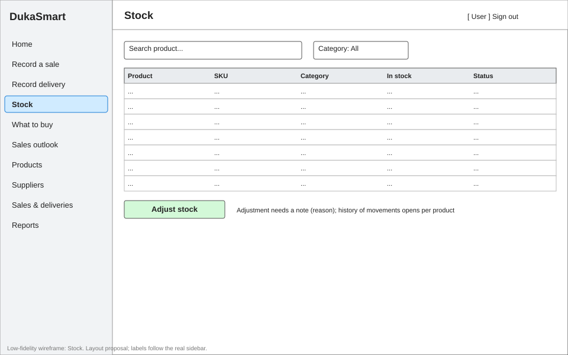

*Note.* Low-fidelity layout by the author. File: wireframes/05_stock.svg.


**Figure 3.30**
*Wireframe of the What to Buy Page*

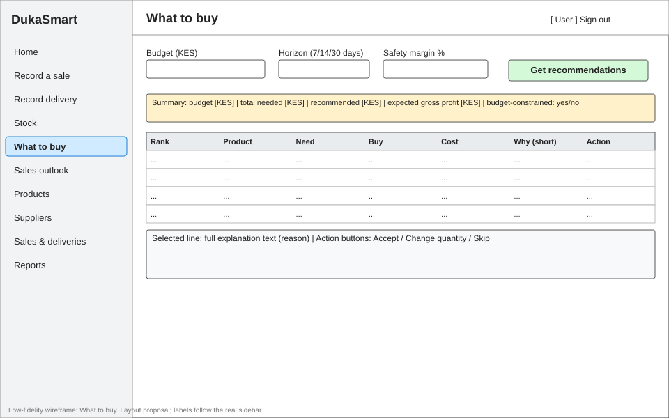

*Note.* Low-fidelity layout by the author. File: wireframes/06_what_to_buy.svg.


**Figure 3.31**
*Wireframe of the Sales Outlook Page*

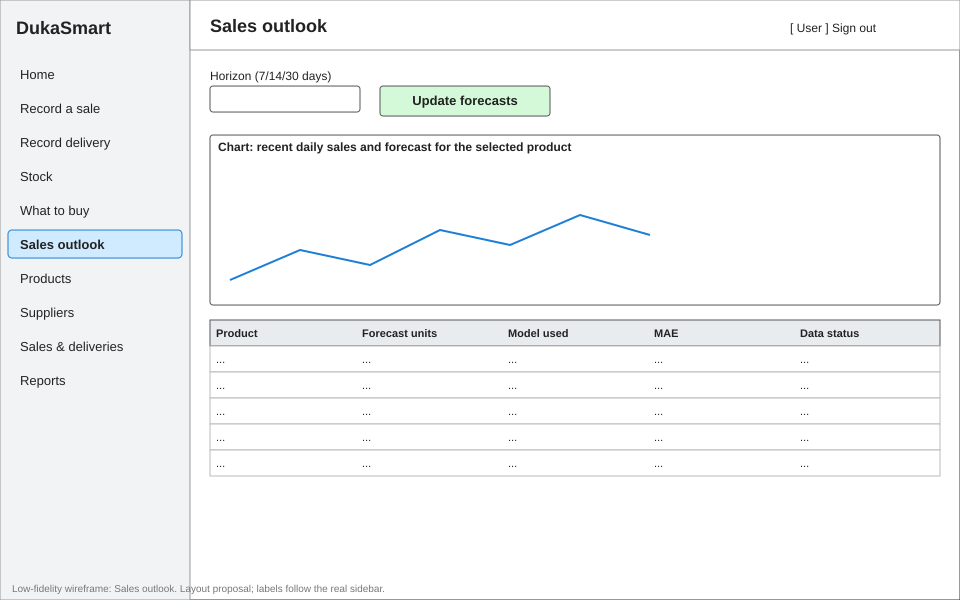

*Note.* Low-fidelity layout by the author. File: wireframes/07_sales_outlook.svg.


**Figure 3.32**
*Wireframe of the Products Page*

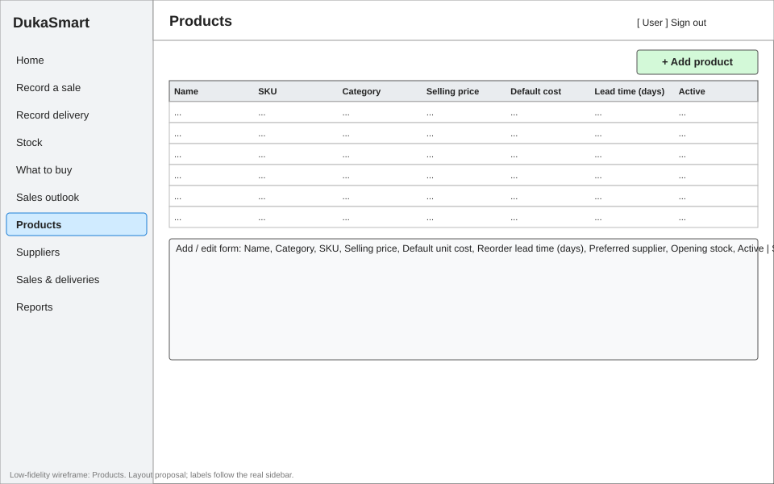

*Note.* Low-fidelity layout by the author. File: wireframes/08_products.svg.


**Figure 3.33**
*Wireframe of the Suppliers Page*

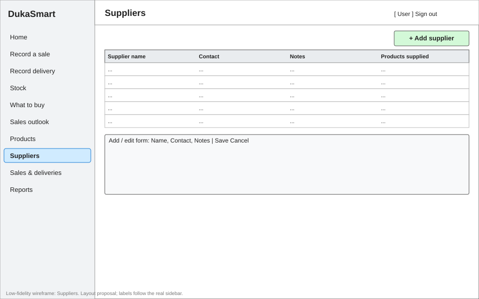

*Note.* Low-fidelity layout by the author. File: wireframes/09_suppliers.svg.


**Figure 3.34**
*Wireframe of the Reports Page*

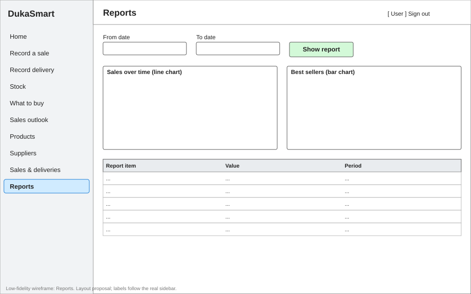

*Note.* Low-fidelity layout by the author. File: wireframes/10_reports.svg.


## Lists of Tables and Figures for Chapter 3 (to merge into the report's front matter)

**List of Tables**

- Table 3.1: Mapping Between Screen Labels and Technical Terms
- Table 3.2: Design Science Stages Applied to DukaSmart
- Table 3.3: Cost and Benefit Items for DukaSmart
- Table 3.4: Technology Stack and Declared Versions
- Table 3.5: Mapping of Questionnaire Sections to Objectives and Requirements
- Table 3.6: Field Study Results Summary (Placeholders)
- Table 3.7: Planned Statistical Outputs and Charts
- Table 3.8: Traceability from Field Findings to Requirements (Placeholders)
- Table 3.9: Functional Requirements and Their Implementation Evidence
- Table 3.10: Business Rules and Default Settings
- Table 3.11: Non-Functional Requirements
- Table 3.12: Requirement Conflicts and Design Resolutions
- Table 3.13: Description of Key Use Cases
- Table 3.14: Worked Example: Inputs and Need Profile (Horizon 14 Days, Safety Margin 20%)
- Table 3.15: Worked Example: Factors, Priority Score and Rank
- Table 3.16: Worked Example: Allocation with a Budget of KES 20,000 (Constrained)
- Table 3.17: Worked Example: Allocation with a Budget of KES 60,000 (Not Constrained)
- Table 3.18: Schema of the users Table
- Table 3.19: Schema of the suppliers Table
- Table 3.20: Schema of the products Table
- Table 3.21: Schema of the product_suppliers Table
- Table 3.22: Schema of the sales Table
- Table 3.23: Schema of the sale_items Table
- Table 3.24: Schema of the purchases Table
- Table 3.25: Schema of the purchase_items Table
- Table 3.26: Schema of the inventory_movements Table
- Table 3.27: Schema of the forecasts Table
- Table 3.28: Schema of the budgets Table
- Table 3.29: Schema of the recommendation_runs Table
- Table 3.30: Schema of the recommendations Table
- Table 3.31: Wireframe Files
- Table 3.32: Input Forms and Validation Rules
- Table 3.33: Tally and Output Plan by Question
- Table 3.34: Blank Tally Sheet (Example for Question B1)
- Table 3.35: Differences Between Project Documents and the Supplied Code

**List of Figures**

- Figure 3.1: Conceptual Workflow of DukaSmart from Sales Records to an Owner Decision
- Figure 3.2: Current Methods of Recording Sales (Placeholder)
- Figure 3.3: Ways Shop Owners Notice Low Stock (Placeholder)
- Figure 3.4: Ranking of Requested System Functions (Placeholder)
- Figure 3.5: Context Diagram of DukaSmart
- Figure 3.6: Level 0 Data Flow Diagram
- Figure 3.7: Level 1 Data Flow Diagram for Process 3.0, Record Transactions
- Figure 3.8: Level 1 Data Flow Diagram for Process 5.0, Recommend Purchases
- Figure 3.9: Use Case Diagram of DukaSmart
- Figure 3.10: Conceptual Class Diagram
- Figure 3.11: Analysis Class Diagram
- Figure 3.12: Layered Architecture of DukaSmart
- Figure 3.13: Component Diagram of DukaSmart
- Figure 3.14: Design Class Diagram of the Persistent Classes
- Figure 3.15: Sequence Diagram for Sign-in
- Figure 3.16: Sequence Diagram for Record a Sale
- Figure 3.17: Sequence Diagram for Generate Recommendations
- Figure 3.18: Flowchart of the Forecasting Pipeline
- Figure 3.19: Activity Flowchart of the Recommendation Run
- Figure 3.20: Priority Score Calculation
- Figure 3.21: Worked Budget Allocation Walk for a Budget of KES 20,000
- Figure 3.22: State Chart of a Recommendation Line
- Figure 3.23: Pseudocode for Need, Priority and Allocation
- Figure 3.24: Entity-Relationship Diagram Derived from the Models
- Figure 3.25: Wireframe of the Login Page
- Figure 3.26: Wireframe of the Home Page
- Figure 3.27: Wireframe of the Record a Sale Page
- Figure 3.28: Wireframe of the Record Delivery Page
- Figure 3.29: Wireframe of the Stock Page
- Figure 3.30: Wireframe of the What to Buy Page
- Figure 3.31: Wireframe of the Sales Outlook Page
- Figure 3.32: Wireframe of the Products Page
- Figure 3.33: Wireframe of the Suppliers Page
- Figure 3.34: Wireframe of the Reports Page

---

# APPENDICES TO CHAPTER 3 (DRAFT)

## Appendix A: Draft Questionnaire and Tally Plan

### A.1 Questionnaire Draft

**Title:** Stock Recording and Restocking Practices in Small Retail Shops in Nairobi County

**Researcher:** Richard Musili Mwendwa, BSc Business Computing, Jomo Kenyatta University of Agriculture and Technology. **Supervisor:** Dennis Njagi.

**Serial number:** ______  **Shop code:** ______ (filled by the researcher; no names are written on this form)  **Date:** ______

**Consent statement.** I am a student of Jomo Kenyatta University of Agriculture and Technology doing a research project on a tool that helps small shops decide what stock to buy. Your answers are voluntary and will be used only for this project. You may skip any question or stop at any time. Your name and shop name will not be written on this form or in the report. Do you agree to take part?  ☐ Yes  ☐ No

*Instruction:* Tick one box unless the question says "tick all that apply".

**Section A: Shop profile**

| Code | Question | Response options and codes |
|---|---|---|
| A1 | What is your role in the shop? | 1 Owner; 2 Attendant or manager; 3 Other (specify) |
| A2 | What does the shop mainly sell? | 1 General retail or groceries; 2 Mostly packaged goods and drinks; 3 Other (specify) |
| A3 | In which sub-county is the shop? | Write the sub-county |
| A4 | How long has the shop been trading? | 1 Less than 1 year; 2 1 to 3 years; 3 4 to 10 years; 4 More than 10 years |
| A5 | About how many different products do you sell? | 1 Fewer than 50; 2 50 to 150; 3 151 to 500; 4 More than 500 |
| A6 | How many people work in the shop, including you? | 1 Only me; 2 Two; 3 Three to five; 4 More than five |
| A7 | Do you use a phone, computer or tablet in the shop for business? (tick all that apply) | 1 Phone; 2 Computer; 3 Tablet; 4 None |

**Section B: Recording sales**

| Code | Question | Response options and codes |
|---|---|---|
| B1 | How do you record sales now? (tick all that apply) | 1 I do not record; 2 Notebook or books; 3 Phone notes or phone calculator; 4 Spreadsheet; 5 Point-of-sale software; 6 M-Pesa statement; 7 Other (specify) |
| B2 | What do you record for each sale? | 1 Only the daily total; 2 Total and some products; 3 Every product sold and its quantity |
| B3 | How often do you update your sales records? | 1 Each sale; 2 End of the day; 3 Once a week; 4 Rarely |
| B4 | Can you tell how many units of a product you sold last month? | 1 Yes, exactly; 2 Roughly; 3 No |
| B5 | I find it easy to keep sales records every day. | Likert 1 Strongly disagree to 5 Strongly agree |

**Section C: Monitoring stock**

| Code | Question | Response options and codes |
|---|---|---|
| C1 | How do you know how much stock you have? (tick all that apply) | 1 I look at the shelves; 2 I count regularly; 3 Stock records; 4 I remember; 5 Other (specify) |
| C2 | How often do you count your stock? | 1 Daily; 2 Weekly; 3 Monthly; 4 Rarely or never |
| C3 | How do you usually find out a product has run out? | 1 A customer asks; 2 I see an empty shelf; 3 My records tell me; 4 Other (specify) |
| C4 | In the last month, how many times did a product run out when customers wanted it? | 1 Never; 2 1 to 2 times; 3 3 to 5 times; 4 More than 5 times |
| C5 | In the last month, did you have products that stayed unsold for a long time? | 1 Yes, many; 2 Yes, a few; 3 No |

**Section D: Buying decisions and budget**

| Code | Question | Response options and codes |
|---|---|---|
| D1 | How do you decide what to buy? (tick all that apply) | 1 What finished or is low; 2 What sells fast; 3 What gives the most profit; 4 What the supplier offers; 5 What I can afford; 6 Other (specify) |
| D2 | Do you set a budget before you go to buy stock? | 1 Yes, a fixed amount; 2 Roughly; 3 No |
| D3 | When money is not enough for everything, what do you do? | 1 Buy the fast sellers first; 2 Buy the cheapest; 3 Buy what I need most to avoid empty shelves; 4 Buy a little of everything; 5 Other (specify) |
| D4 | Do you know the profit you make on each product? | 1 Yes, for most; 2 For some; 3 No |
| D5 | How often do you buy stock? | 1 Daily; 2 Weekly; 3 Every two weeks; 4 Monthly |
| D6 | How many days after ordering does stock normally arrive? | 1 Same day; 2 1 to 2 days; 3 3 to 7 days; 4 More than a week |

**Section E: Challenges**

| Code | Question | Response options and codes |
|---|---|---|
| E1 | Which are your biggest challenges when restocking? (tick up to three) | 1 Not knowing how much to buy; 2 Not knowing what sells best; 3 Limited money; 4 Late deliveries; 5 Price changes; 6 Poor records; 7 Other (specify) |
| E2 | I often buy too much of some products and too little of others. | Likert 1 to 5 |
| E3 | I would like help in deciding what to buy first when money is limited. | Likert 1 to 5 |
| E4 | In your own words, what is the hardest part of deciding what to buy? | Open answer |

**Section F: Expected system functions**

| Code | Question | Response options and codes |
|---|---|---|
| F1 | Rank these functions from 1 (most useful) to 6 (least useful) | Record sales; Record deliveries; Show current stock; Warn when stock is low; Suggest what to buy within my budget; Explain why a product is suggested |
| F2 | Would you prefer to use the system on a: | 1 Phone; 2 Computer; 3 Either |
| F3 | Which language would you prefer? | 1 English; 2 Kiswahili; 3 Both |
| F4 | Would you trust a suggestion more if it explained the reason? | 1 Yes; 2 Somewhat; 3 No |
| F5 | Any other function you would want? | Open answer |

*Thank you for your time.*

### A.2 Tally Plan

The tally plan explains how each answer is counted. Every closed answer has a numeric code shown in the questionnaire, and each respondent becomes one row in the Excel sheet with one column per question. For tick-all-that-apply questions, each option becomes its own yes/no column so that percentages are based on respondents and can add to more than 100%. For ranking question F1, the rank given to each function is entered, and the mean rank per function is computed. Open answers are typed in full and later coded into themes. Table 3.33 states the counting rule and the planned output for each question group, and Table 3.34 shows the blank tally sheet to be used during analysis.

**Table 3.33**
*Tally and Output Plan by Question*

| Questions | Variable type | How to tally | Output |
|---|---|---|---|
| A1, A2, A4, A5, A6 | Single choice | Count per code; divide by valid n | Frequency table and pie chart |
| A3 | Text | Group by sub-county | Frequency table |
| A7, B1, C1, D1, E1 | Multiple choice | One yes/no column per option; count yes | Bar chart; percent of respondents |
| B2, B3, B4, C2, C3, C4, C5, D2, D3, D4, D5, D6, F2, F3, F4 | Single choice | Count per code; divide by valid n | Frequency table; pie or bar chart |
| B5, E2, E3 | Likert 1 to 5 | Count per score; compute median and mode | Stacked bar; median |
| F1 | Rank | Mean rank per function | Bar chart of mean rank |
| E4, F5 | Open | Type answers; code into themes; count respondents per theme | Theme table |
| A5 by B1; A4 by C4 | Two variables | Cross-tabulation | Cross-tab table; chi-square if assumptions hold |

*Note.* Prepared by the author. Percentages are based on valid answers for each question.

**Table 3.34**
*Blank Tally Sheet (Example for Question B1)*

| Code | Option | Tally marks | Count (n) | Percent of respondents |
|---|---|---|---|---|
| 1 | I do not record | <mark style="background:yellow">[INSERT: tally]</mark> | <mark style="background:yellow">[INSERT: n]</mark> | <mark style="background:yellow">[INSERT: %]</mark> |
| 2 | Notebook or books | <mark style="background:yellow">[INSERT: tally]</mark> | <mark style="background:yellow">[INSERT: n]</mark> | <mark style="background:yellow">[INSERT: %]</mark> |
| 3 | Phone notes or calculator | <mark style="background:yellow">[INSERT: tally]</mark> | <mark style="background:yellow">[INSERT: n]</mark> | <mark style="background:yellow">[INSERT: %]</mark> |
| 4 | Spreadsheet | <mark style="background:yellow">[INSERT: tally]</mark> | <mark style="background:yellow">[INSERT: n]</mark> | <mark style="background:yellow">[INSERT: %]</mark> |
| 5 | Point-of-sale software | <mark style="background:yellow">[INSERT: tally]</mark> | <mark style="background:yellow">[INSERT: n]</mark> | <mark style="background:yellow">[INSERT: %]</mark> |
| 6 | M-Pesa statement | <mark style="background:yellow">[INSERT: tally]</mark> | <mark style="background:yellow">[INSERT: n]</mark> | <mark style="background:yellow">[INSERT: %]</mark> |
| 7 | Other (specify) | <mark style="background:yellow">[INSERT: tally]</mark> | <mark style="background:yellow">[INSERT: n]</mark> | <mark style="background:yellow">[INSERT: %]</mark> |
| | Valid respondents | | <mark style="background:yellow">[INSERT: n]</mark> | |

*Note.* The same layout is repeated for every closed question.

## Appendix B: Draft Interview Guide

The interview lasts about ten minutes and follows the questionnaire themes. The researcher introduces the project, reads the consent statement and asks permission to take notes. Answers are written as spoken and are not paraphrased into claims. The probes are used only when the first answer is short. The guide is a draft and will be adjusted after the pilot.

1. Please describe what you do from the moment stock arrives until it is sold. (Probe: where are things written down?)
2. Tell me about the last time a product ran out. How did you find out, and what did you do?
3. How do you decide how much of each product to buy? (Probe: what do you look at?)
4. When you do not have enough money for everything, how do you choose what to buy first?
5. What would you want a tool to tell you before you go to buy stock?
6. If a tool suggested a purchase list, what would you need to see before you trusted it?
7. What would make a tool like this hard for you or your staff to use?

## Appendix C: Differences Between the Context Pack and the Code

Table 3.35 lists the places where the project documents and the supplied code disagree. In every case this chapter follows the code. The author should update the earlier chapters, the slides and the draft document so that they match. Differences of wording only, such as screen labels, are not listed. The table also notes the points that could not be checked because some files were not supplied.

**Table 3.35**
*Differences Between Project Documents and the Supplied Code*

| No. | Project document says | Code does | Action |
|---|---|---|---|
| 1 | Projected need = forecast demand + safety stock | Projected need = forecast demand + lead-time demand + safety stock, with safety applied to both | Update Chapter 1 and the slides |
| 2 | Forecasts scored with MAE and RMSE; exponential smoothing is the primary method | Scores MAE and MAPE only; three models compete; lowest MAE wins with ties within 1% going to the simpler model | Update objectives, Chapter 1 and the slides; add RMSE to the code only if it is truly needed |
| 3 | Fixed 14-day hold-out | Hold-out is the smaller of 14 days, 30% of history, and history minus 21 days | Describe as a capped 14-day hold-out |
| 4 | Cost efficiency is part of the priority score (earlier design) | Cost efficiency and velocity are stored but not in the score; priority uses risk, demand, expected gross profit and affordability | Remove any mention of cost efficiency as a factor |
| 5 | Adjustments need a reason; SQLite foreign keys and WAL are on; owner-only routes | The services take a note but do not reject an empty one; routers, database.py and main.py were not supplied, so these claims could not be verified; enumeration check constraints are probably not created | Confirm in the unsupplied files and in dukasmart.db before submission |

*Note.* Compiled by the author. The file key_code.txt was not present as a separate upload; the code was read from the pasted code document.
